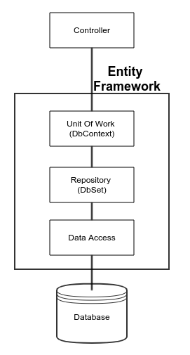

# Repository 模式 (Repository Pattern)

## Repository 模式的好處
在軟體分層那篇文章中，資料存取層的實作便是 Repository 模式的體現，有效的將資料存取隔離於商業邏輯之外，當要抽換資料來源時，無須改動展示層與商業邏輯層(前提是 Repoistory 約定的介面沒有變動)。

## 專用型 IRepository 與 泛型 IRepository
我們先定義兩種應用的模式

* 專用型 Repository：一個 interface 實作 一個 Repository
``` c#
public interface IBlogRepository
{
    // ....
}

public class BlogRepository : IBlogRepository
{
    // ....
}

public interface IPostRepository
{
    // ....
}

public class PostRepository : IPostRepository
{
    // ....
}
```

* 泛型 Repository：一個 interface 實作 一個 Repository，透過不同的 TEntity 來操作不同的資料表。
``` c#
public interface IGenericRepository<TEntity>
{
    // ....
}

public class GenericRepository : GenericRepository<TEntity>
{
    // ....
}
```

當 Repository 有不同的介面方法的時候，專用型 Repository 能提供最大的彈性。

當 Repoitory 有固定的 CRUD 的介面方法，泛型 Repository 可以有效的減少重複的程式碼。


## 專用型 Repository

### DBContext

EFCore 使用指定產生出 DBContext 如下
``` c#
/// <summary>
///
/// </summary>
/// <seealso cref="Microsoft.EntityFrameworkCore.DbContext" />
public partial class BloggingContext : DbContext
{
    /// <summary>
    /// Initializes a new instance of the <see cref="BloggingContext"/> class.
    /// </summary>
    public BloggingContext()
    {
    }

    /// <summary>
    /// Initializes a new instance of the <see cref="BloggingContext"/> class.
    /// </summary>
    /// <param name="options">The options.</param>
    public BloggingContext(DbContextOptions<BloggingContext> options)
        : base(options)
    {
    }

    /// <summary>
    /// blog.
    /// </summary>
    public virtual DbSet<Blog> Blog { get; set; }

    /// <summary>
    /// post.
    /// </summary>
    public virtual DbSet<Post> Post { get; set; }

    /// <summary>
    /// <para>
    /// Override this method to configure the database (and other options) to be used for this context.
    /// This method is called for each instance of the context that is created.
    /// The base implementation does nothing.
    /// </para>
    /// <para>
    /// In situations where an instance of <see cref="T:Microsoft.EntityFrameworkCore.DbContextOptions" /> may or may not have been passed
    /// to the constructor, you can use <see cref="P:Microsoft.EntityFrameworkCore.DbContextOptionsBuilder.IsConfigured" /> to determine if
    /// the options have already been set, and skip some or all of the logic in
    /// <see cref="M:Microsoft.EntityFrameworkCore.DbContext.OnConfiguring(Microsoft.EntityFrameworkCore.DbContextOptionsBuilder)" />.
    /// </para>
    /// </summary>
    /// <param name="optionsBuilder">A builder used to create or modify options for this context. Databases (and other extensions)
    /// typically define extension methods on this object that allow you to configure the context.</param>
    protected override void OnConfiguring(DbContextOptionsBuilder optionsBuilder)
    {
    }

    /// <summary>
    /// Override this method to further configure the model that was discovered by convention from the entity types
    /// exposed in <see cref="T:Microsoft.EntityFrameworkCore.DbSet`1" /> properties on your derived context. The resulting model may be cached
    /// and re-used for subsequent instances of your derived context.
    /// </summary>
    /// <param name="modelBuilder">The builder being used to construct the model for this context. Databases (and other extensions) typically
    /// define extension methods on this object that allow you to configure aspects of the model that are specific
    /// to a given database.</param>
    /// <remarks>
    /// If a model is explicitly set on the options for this context (via <see cref="M:Microsoft.EntityFrameworkCore.DbContextOptionsBuilder.UseModel(Microsoft.EntityFrameworkCore.Metadata.IModel)" />)
    /// then this method will not be run.
    /// </remarks>
    protected override void OnModelCreating(ModelBuilder modelBuilder)
    {
        modelBuilder.HasAnnotation("ProductVersion", "2.2.6-servicing-10079");

        modelBuilder.Entity<Blog>(entity =>
        {
            entity.Property(e => e.Url).IsRequired();
        });

        modelBuilder.Entity<Post>(entity =>
        {
            entity.HasOne(d => d.Blog)
                .WithMany(p => p.Post)
                .HasForeignKey(d => d.BlogId);
        });
    }
}
```

### Respository 介面
``` c#
/// <summary>
/// Interface BlogRepository
/// </summary>
public interface IBlogRepository
{
    /// <summary>
    /// 新增 Blog
    /// </summary>
    /// <param name="blog">Blog 實體</param>
    Task<int> AddAsync(Blog blog);

    /// <summary>
    /// 取得所有 Blog
    /// </summary>
    /// <param name="blogQuery">查詢條件</param>
    Task<IEnumerable<Blog>> GetAsync(BlogQuery blogQuery);

    /// <summary>
    /// 刪除 Blog
    /// </summary>
    /// <param name="blog">Blog 實體</param>
    Task<int> RemoveAsync(Blog blog);

    /// <summary>
    /// 更新 Blog
    /// </summary>
    /// <param name="blog">Blog 實體</param>
    Task<int> UpdateAsync(Blog blog);
}
```

### Repository 實作

Repository 介面與 Service 使用都不需修改，只需修改 Repository 實作的部分 (有沒有開始感受到分層抽離，依賴建介面的好處)
``` c#
/// <summary>
/// Class BlogRepository.
/// Implements the <see cref="Sample.Repository.Interface.IBlogRepository" />
/// </summary>
/// <seealso cref="Sample.Repository.Interface.IBlogRepository" />
public class BlogRepository : IBlogRepository
{
    /// <summary>
    /// The database
    /// </summary>
    private readonly BloggingContext _context;

    /// <summary>
    /// Initializes a new instance of the <see cref="BlogRepository"/> class.
    /// </summary>
    /// <param name="context">The context.</param>
    public BlogRepository(BloggingContext context)
    {
        this._context = context;
    }

    /// <summary>
    /// 新增 Blog
    /// </summary>
    /// <param name="blog">實體</param>
    /// <returns></returns>
    public async Task<bool> AddAsync(Blog blog)
    {
        _context.Add(blog);
        var count = await _context.SaveChangesAsync();

        return count > 0;
    }

    /// <summary>
    /// 取得 Blog
    /// </summary>
    /// <param name="condition">查詢條件</param>
    /// <returns></returns>
    public async Task<IEnumerable<Blog>> GetAsync(BlogQuery condition)
    {
        var blogs = await _context.Blog.ToListAsync();
        return blogs;
    }

    /// <summary>
    /// 刪除 Blog
    /// </summary>
    /// <param name="id">blog id</param>
    /// <returns></returns>
    public async Task<bool> RemoveAsync(int id)
    {
        var blog = await _context.Blog.FindAsync(id);
        _context.Blog.Remove(blog);
        var count = await _context.SaveChangesAsync();

        return count > 0;
    }

    /// <summary>
    /// 更新 Blog
    /// </summary>
    /// <param name="blog">實體</param>
    /// <returns></returns>
    public async Task<bool> UpdateAsync(Blog blog)
    {
        _context.Update(blog);
        var count = await _context.SaveChangesAsync();

        return count > 0;
    }
}
```

### Service 的應用
注入 IBlogRepository 就可以使用。
``` c#
```

### 注入設定
``` c#
/// <summary>
/// This method gets called by the runtime. Use this method to add services to the container.
/// </summary>
/// <param name="services"></param>
public void ConfigureServices(IServiceCollection services)
{
    var connection = this.Configuration.GetConnectionString("DefaultConnection");

    // DI Register
    services.AddScoped<IBlogService, BlogService>();
    services.AddScoped<IBlogRepository, BlogRepository>();

    services.AddDbContext<BloggingContext>(
        options => options.UseSqlServer(connection));
    services.AddAutoMapper(AppDomain.CurrentDomain.GetAssemblies());

    ///...............
}
```


## 泛型 Repository 模式

### 泛型 IRepository
``` c#
/// <summary>
/// Interface Repository
/// </summary>
public interface IGenericRepository<TEntity> where TEntity : class
{
    /// <summary>
    /// 新增
    /// </summary>
    /// <param name="entity">實體</param>
    void Add(TEntity entity);

    /// <summary>
    /// 取得全部
    /// </summary>
    /// <returns></returns>
    Task<ICollection<TEntity>> GetAllAsync();

    /// <summary>
    /// 取得單筆
    /// </summary>
    /// <param name="predicate">查詢條件</param>
    /// <returns></returns>
    Task<TEntity> GetAsync(Expression<Func<TEntity, bool>> predicate);

    /// <summary>
    /// 刪除
    /// </summary>
    /// <param name="entity">實體</param>
    void Remove(TEntity entity);

    /// <summary>
    /// 更新
    /// </summary>
    /// <param name="entity">實體</param>
    void Update(TEntity entity);
}
```

### 泛型 IRepository 實作
``` c#
/// <summary>
///
/// </summary>
/// <typeparam name="TEntity">The type of the entity.</typeparam>
/// <seealso cref="Sample.Repository.Interface.IGenericRepository{TEntity}" />
public class GenericRepository<TEntity> : IGenericRepository<TEntity> where TEntity : class
{
    /// <summary>
    /// UnitOfWork 實體
    /// </summary>
    private readonly IUnitOfWork _unitOfWork;

    /// <summary>
    /// Initializes a new instance of the <see cref="GenericRepository{TEntity}"/> class.
    /// </summary>
    /// <param name="unitofwork">The unitofwork.</param>
    public GenericRepository(IUnitOfWork unitofwork)
    {
        this._unitOfWork = unitofwork;
    }

    /// <summary>
    /// 新增
    /// </summary>
    /// <param name="entity">實體</param>
    public void Add(TEntity entity)
    {
        if (entity == null)
        {
            throw new ArgumentNullException("entity");
        }

        _unitOfWork.Context.Set<TEntity>().Add(entity);
    }

    /// <summary>
    /// 取得全部
    /// </summary>
    /// <returns></returns>
    public async Task<ICollection<TEntity>> GetAllAsync()
    {
        return await this._unitOfWork.Context.Set<TEntity>().ToListAsync();
    }

    /// <summary>
    /// 取得單筆
    /// </summary>
    /// <param name="predicate">查詢條件</param>
    /// <returns></returns>
    public async Task<TEntity> GetAsync(Expression<Func<TEntity, bool>> predicate)
    {
        return await this._unitOfWork.Context.Set<TEntity>().FirstOrDefaultAsync(predicate);
    }

    /// <summary>
    /// 刪除
    /// </summary>
    /// <param name="entity">實體</param>
    public void Remove(TEntity entity)
    {
        if (entity == null)
        {
            throw new ArgumentNullException("entity");
        }

        this._unitOfWork.Context.Entry(entity).State = EntityState.Deleted;
    }

    /// <summary>
    /// 更新
    /// </summary>
    /// <param name="entity">實體</param>
    public void Update(TEntity entity)
    {
        if (entity == null)
        {
            throw new ArgumentNullException("entity");
        }

        this._unitOfWork.Context.Entry(entity).State = EntityState.Modified;
    }
}
```

### 注入設定
``` c#
/// <summary>
/// This method gets called by the runtime. Use this method to add services to the container.
/// </summary>
/// <param name="services"></param>
public void ConfigureServices(IServiceCollection services)
{
    var connection = this.Configuration.GetConnectionString("DefaultConnection");

    // DI Register
    services.AddScoped<IBlogService, BlogService>();
    services.AddScoped<IGenericRepository<Blog>, GenericRepository<Blog>>();
    services.AddScoped<DbContext, BloggingContext>();
    services.AddDbContext<BloggingContext>(
         options => options.UseSqlServer(connection));
```

## Repository Pattern & Unit Of Work
職責分離
首先先調整 UnitOfWork 的介面與實作
``` c#
    /// <summary>
    /// UnitOfWork 介面
    /// </summary>
    /// <seealso cref="System.IDisposable" />
    public interface IUnitOfWork : IDisposable
    {
        /// <summary>
        ///
        /// </summary>
        IGenericRepository<Blog> BlogRepository { get; }

        /// <summary>
        /// DB Context
        /// </summary>
        DbContext Context { get; }

        /// <summary>
        /// Saves the change.
        /// </summary>
        /// <returns></returns>
        Task<int> SaveChangeAsync();
    }
}

    /// <summary>
    /// UnitOfWork
    /// </summary>
    public class UnitOfWork : IUnitOfWork
    {
        /// <summary>
        ///
        /// </summary>
        private bool disposed = false;

        /// <summary>
        /// Initializes a new instance of the <see cref="UnitOfWork"/> class.
        /// </summary>
        /// <param name="context">The context.</param>
        /// <param name="blogRepository">The blog repository.</param>
        public UnitOfWork(
            DbContext context,
            IGenericRepository<Blog> blogRepository)
        {
            this.Context = context;
            this.BlogRepository = blogRepository;
        }

        /// <summary>
        /// </summary>
        public IGenericRepository<Blog> BlogRepository { get; private set; }

        /// <summary>
        /// Context
        /// </summary>
        public DbContext Context { get; private set; }

        /// <summary>
        /// Dispose
        /// </summary>
        public void Dispose()
        {
            Dispose(true);
            GC.SuppressFinalize(this);
        }

        /// <summary>
        /// SaveChange
        /// </summary>
        /// <returns></returns>
        public async Task<int> SaveChangeAsync()
        {
            return await this.Context.SaveChangesAsync();
        }

        /// <summary>
        /// Dispose
        /// </summary>
        /// <param name="disposing"></param>
        protected virtual void Dispose(bool disposing)
        {
            if (!this.disposed)
            {
                if (disposing)
                {
                    this.Context.Dispose();
                    this.Context = null;
                }
            }
            this.disposed = true;
        }
    }
```

再來修改 Repository 的實作
``` c#
/// <summary>
 ///
 /// </summary>
 /// <typeparam name="TEntity">The type of the entity.</typeparam>
 /// <seealso cref="Sample.Repository.Implement.GenericRepository{TEntity}" />
 public class BlogRepository<TEntity> : GenericRepository<TEntity> where TEntity : class
 {
     /// <summary>
     /// Initializes a new instance of the <see cref="BlogRepository{TEntity}"/> class.
     /// </summary>
     /// <param name="context">db context.</param>
     public BlogRepository(DbContext context) : base(context)
     {
     }
 }
```

再來是 Service 的修改
``` c#
/// <summary>
/// BlogService
/// </summary>
public class BlogService : IBlogService
{
    private IMapper _mapper;
    private IUnitOfWork _unitofwork;

    /// <summary>
    /// Initializes a new instance of the <see cref="BlogService"/> class.
    /// </summary>
    public BlogService(
        IUnitOfWork unitofwork,
        IMapper mapper)
    {
        this._unitofwork = unitofwork;
        this._mapper = mapper;
    }

    /// <summary>
    /// 新增 Blog
    /// </summary>
    /// <param name="blogDto">Blog Dto</param>
    /// <returns></returns>
    public async Task<int> AddAsync(BlogDto blogDto)
    {
        // Convert BlogDto to Blog
        var blog = this._mapper.Map<Blog>(blogDto);

        this._unitofwork.BlogRepository.Add(blog);
        return await this._unitofwork.SaveChangeAsync();
    }

    /// <summary>
    /// 取得 Blog
    /// </summary>
    /// <param name="blogQueryDto">查詢條件</param>
    /// <returns></returns>
    public async Task<IEnumerable<BlogDto>> GetAsync(BlogQueryDto blogQueryDto)
    {
        var blogs = await this._unitofwork.BlogRepository.GetAllAsync();

        // Convert Blog to BlogDto
        var blogDtos = this._mapper.Map<IEnumerable<BlogDto>>(blogs);

        return blogDtos;
    }

    /// <summary>
    /// 刪除 Blog
    /// </summary>
    /// <param name="blogId">Blog Id</param>
    /// <returns></returns>
    public async Task<int> RemoveAsync(int blogId)
    {
        var blog = await this._unitofwork.BlogRepository.GetAsync(x => x.BlogId == blogId);

        this._unitofwork.BlogRepository.Remove(blog);
        return await this._unitofwork.SaveChangeAsync();
    }

    /// <summary>
    /// 修改 Blog
    /// </summary>
    /// <param name="blogDto">Blog Dto</param>
    /// <returns></returns>
    public async Task<int> UpdateAsync(BlogDto blogDto)
    {
        // Convert BlogDto to Blog
        var blog = this._mapper.Map<Blog>(blogDto);

        this._unitofwork.BlogRepository.Update(blog);
        return await this._unitofwork.SaveChangeAsync();
    }
}
```

整個專案的架構圖如下


