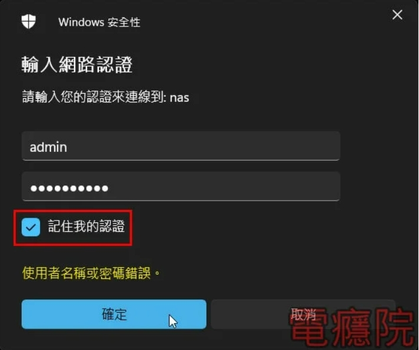
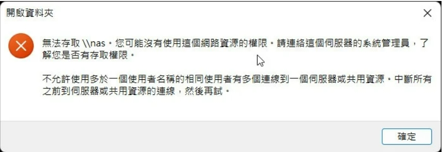
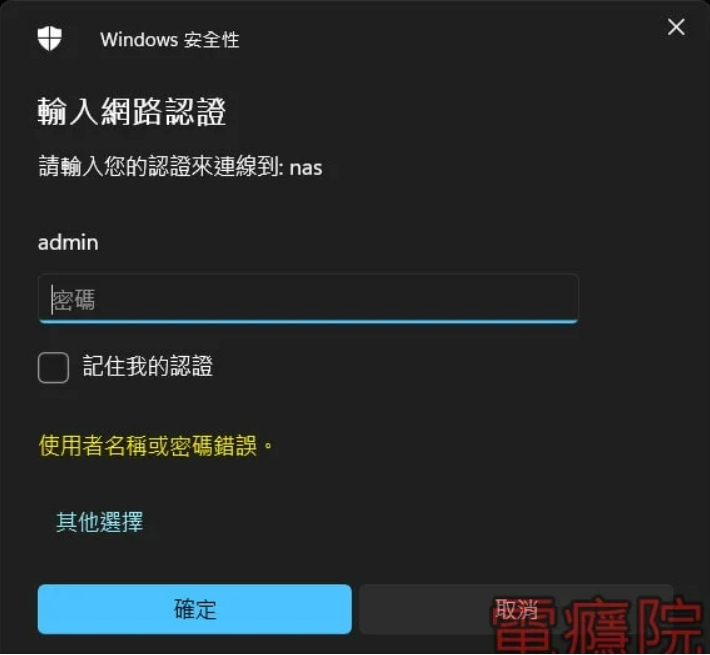
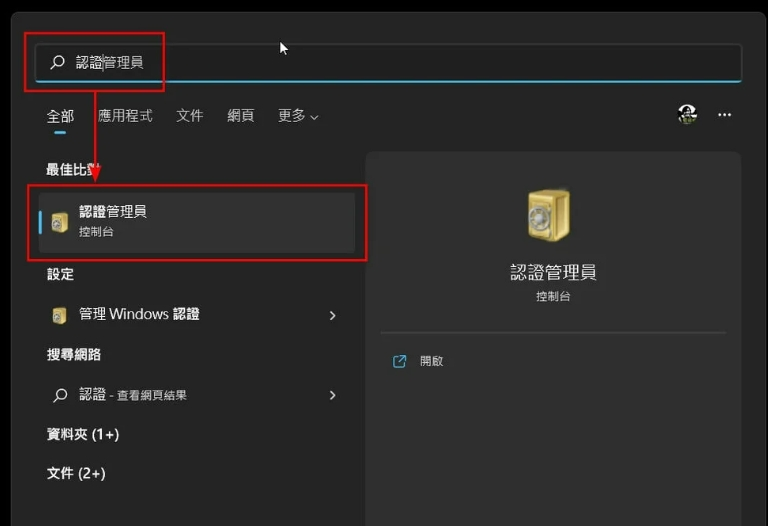
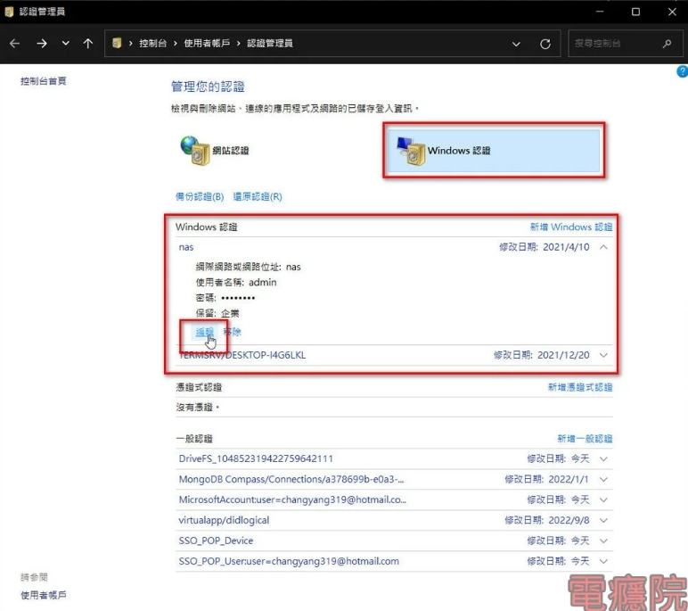
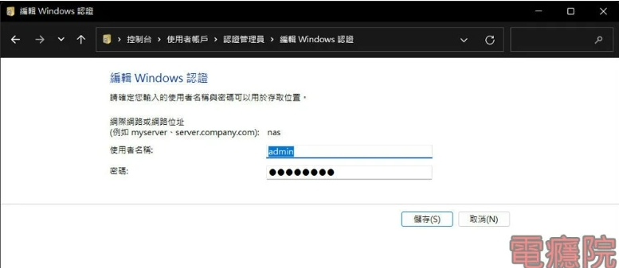

# WINDOWS共用資料夾的網路認證密碼放在哪？如何清除？

通常是在工作的場合，有時我們會去連接別台電腦所分享出來的資料夾，或是使用公司的NAS，在登入時都要輸入網路認證的帳號及密碼，在輸入完帳密之後，我們通常都會勾選「記住我的認證」，然後再點擊〔確定〕，如下圖：

這樣下次如果還要再連接時，就不需要再輸入帳密一次。

但有時，可能對方的帳號或密碼改變了，所以我們在Windows裡所記錄下來的這些網路認證資料，就會沒有用，我們開啟時，就會出現類似這樣的「開啟資料夾」的錯誤訊息，告訴我們沒有這個網路資源的權限，如下圖：

像在Windows 11時，登入錯誤時，會告訴你「使用者名稱或密碼錯誤」，這時只要把正確的密碼再填入就可以了，如下圖：

但有時，或在其它版本的Windows，就會一直反覆出現錯誤訊息，也不給修正已儲存的錯誤帳密，這時，我們就要直接去Windows儲存網路認證資訊的地方，修改這些資訊。

## Windows的「認證管理員」

要開啟這個存放「網路認證」的地方很容易，點擊Windows下方的搜尋工作列後，輸入「認證管理員」，再點擊該項目，如下圖：

接著點擊「Windows認證」，並找到你想要修改的名稱，以我的來說，我登入的裝置名稱叫「nas」，這時可以點擊「編輯」，就可以對這筆資料做修改，如下圖：

輸入完之後，再按下〔儲存〕即可，如下圖：

甚至也能點擊「移除」，直接移除這個裝置的帳密資料，這樣下次你再登入這個裝置時，就會再跳出要輸入帳號密碼的對話盒。