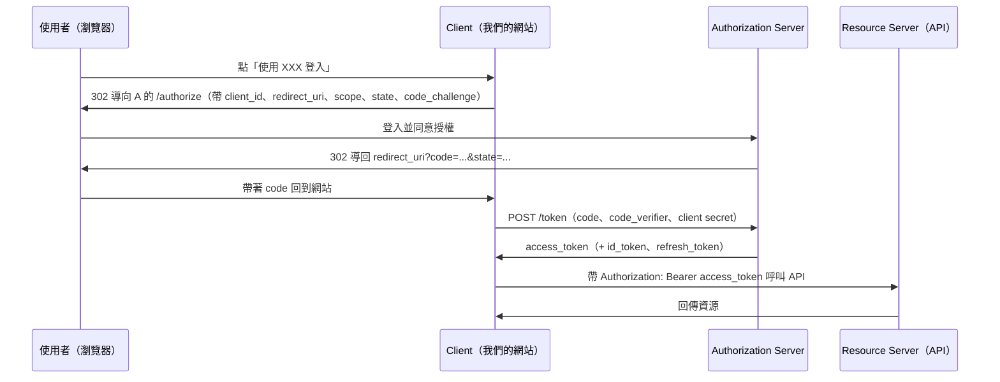

# OAuth 與 SSO

## 先釐清三個常混用的名詞

| 名詞 | 解決的問題 | 一句話 |
|---|---|---|
| **OAuth 2.0** | 授權（Authorization） | 讓第三方應用在使用者同意下，用有限的權限存取使用者在某服務上的資源，而不必拿到使用者的密碼。 |
| **OpenID Connect（OIDC）** | 身分驗證（Authentication） | 建立在 OAuth 2.0 之上，多了 ID Token，用來回答「這個人是誰」。 |
| **SSO（Single Sign-On）** | 使用者體驗 | 登入一次，就能進入多個彼此信任的系統。是一種目標，不是協定；可以用 OIDC、SAML、CAS 等協定實現。 |

常見的誤解是「用 OAuth 做登入」。嚴格說 OAuth 2.0 只發 Access Token，不保證 token 的持有者就是使用者本人；要做登入應該用 OIDC，拿 ID Token 來確認身分。實務上「用 Google／LINE 登入」就是 OIDC，只是大家習慣叫它 OAuth。

## 角色

### OAuth 2.0 定義的四個角色

- **Resource Owner**：資源擁有者，通常就是終端使用者。
- **Client**：想要存取資源的應用程式，也就是我們開發的網站或 App。
- **Authorization Server**：負責驗證使用者並核發 token 的伺服器。
- **Resource Server**：存放受保護資源的伺服器，收到 token 後決定要不要放行。

### 對應到實際場景

| 角色 | 自建服務 | 第三方登入（LINE、Google、Microsoft） |
|---|---|---|
| Authorization Server | Keycloak、IdentityServer／Duende、ASP.NET Core Identity + OpenIddict | LINE Login、Google Identity、Microsoft Entra ID |
| Resource Server | 自家的 Web API | 第三方的 API（例如 Google Calendar API） |
| Client | 自家的網站、行動 App | 自家的網站、行動 App |
| Resource Owner | 網站使用者 | 擁有 LINE／Google／Microsoft 帳號的使用者 |

## 授權流程（Grant Type）

| 流程 | 適用情境 | 備註 |
|---|---|---|
| **Authorization Code + PKCE** | 網站、SPA、行動 App，只要有使用者在場都用這個 | 目前的標準做法。PKCE 讓沒有 client secret 的前端也能安全使用。 |
| **Client Credentials** | 服務對服務，沒有使用者 | 例如排程程式呼叫內部 API。 |
| **Device Code** | 沒有瀏覽器或不方便輸入的裝置 | 電視、CLI 工具。 |
| Implicit | 舊版 SPA | 已不建議使用，改用 Authorization Code + PKCE。 |
| Resource Owner Password | 舊系統過渡 | 應用程式會拿到密碼，違背 OAuth 初衷，已不建議使用。 |

### Authorization Code 流程

幾個必須做對的細節：

- **state**：防 CSRF，導回時要比對是否與送出時一致。
- **PKCE（code_verifier／code_challenge）**：防止授權碼被攔截後拿去換 token。
- **redirect_uri**：必須在 Authorization Server 預先登記且完全相符。
- **scope**：只要最小必要權限，例如 `openid profile email`。

## Token

| Token | 給誰用 | 內容 | 壽命 |
|---|---|---|---|
| **Access Token** | Resource Server | 授權範圍（scope）、到期時間；格式可以是 JWT 或不透明字串 | 短，通常幾分鐘到一小時 |
| **ID Token** | Client | 一定是 JWT，內含使用者身分（sub、name、email 等）與核發資訊 | 短，用完即可丟 |
| **Refresh Token** | Client 向 Authorization Server 換新 token | 不透明字串 | 長，需妥善保管並支援撤銷 |

Client 收到 ID Token 後必須驗證簽章、`iss`、`aud`、`exp`、`nonce`，不能只解 base64 就相信裡面的內容。

## SSO 的實現方式

SSO 的核心是「有一個集中的身分提供者（Identity Provider，IdP），各系統都信任它」。使用者在 IdP 登入一次後，IdP 會記住這個登入狀態（通常是 IdP 網域下的 Cookie），之後其他系統把使用者導到 IdP 時，IdP 看到已登入就直接發 token 導回，使用者不用再輸入帳密。

| 協定 | 適用 | 特色 |
|---|---|---|
| **OIDC** | 新系統、Web／行動／API | 以 JSON 與 JWT 為基礎，最容易整合，第一選擇。 |
| **SAML 2.0** | 企業內部系統、老牌 SaaS | XML 為基礎，設定較繁瑣，但企業採用廣。 |
| **CAS** | 校園、內部系統 | 較舊的協定，實作方式見同目錄的〈Single Sign On 實作方式介紹 (CAS)〉。 |
| Cookie 共用 | 同一根網域下的多個子網站 | 不是真正的 SSO 協定，見〈ASP.NET Core Authentication 系列（四）〉。 |

### 在 ASP.NET Core 裡的對應

- 自建 IdP：Keycloak（見 infra/docker 與 aspnet-core 的 KeyCloak 文章）、Duende IdentityServer、OpenIddict。
- 網站當 Client：`AddAuthentication().AddCookie().AddOpenIdConnect(...)`，登入狀態靠本地 Cookie 維持，OIDC 只在登入那一刻用到。
- API 當 Resource Server：`AddAuthentication().AddJwtBearer(...)`，只驗 Access Token，不管使用者怎麼登入的。
- 登出：除了清本地 Cookie，還要導到 IdP 的 end_session 端點做「單一登出」，否則使用者在其他系統仍是登入狀態。

## 登入後的個資管理

第三方登入只會給我們 IdP 願意提供的基本資料（名稱、Email、頭像），其餘個資（電話、地址、統一編號、身分證字號）仍要由自家系統蒐集與保管：

- 用 ID Token 的 `sub` 當作外部身分的唯一鍵，對應到自家的使用者資料表，不要用 Email 當主鍵（Email 可以改）。
- 一個使用者可能綁多個外部身分（LINE 也綁、Google 也綁），資料表設計要是一對多。
- 敏感個資依個資法規範蒐集最小必要範圍，並做存取控管與加密儲存。

## 延伸閱讀

- [OAuth 2.0 (RFC 6749)](https://datatracker.ietf.org/doc/html/rfc6749)
- [OAuth 2.0 Security Best Current Practice](https://datatracker.ietf.org/doc/html/draft-ietf-oauth-security-topics)
- [OpenID Connect Core 1.0](https://openid.net/specs/openid-connect-core-1_0.html)
- [PKCE (RFC 7636)](https://datatracker.ietf.org/doc/html/rfc7636)
