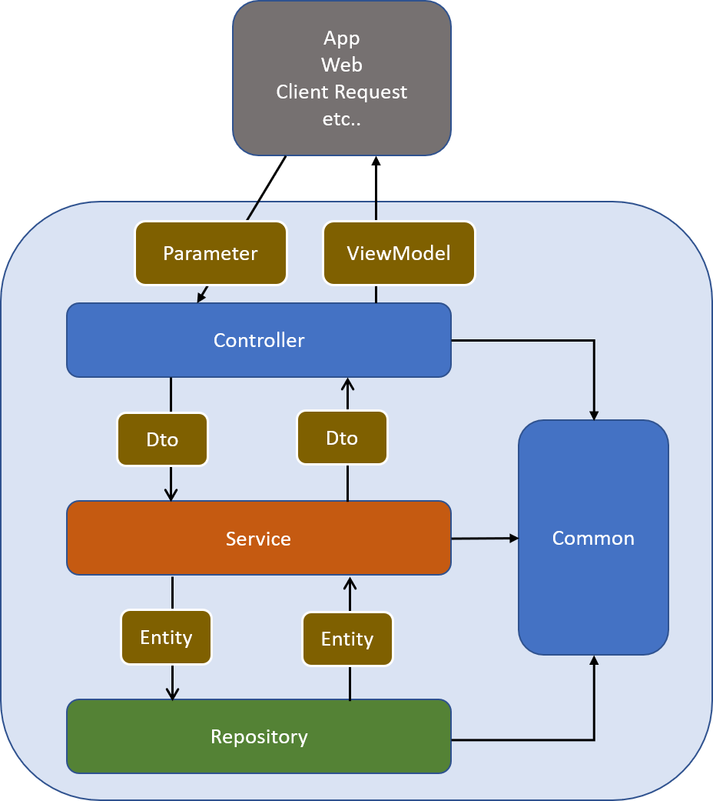

# 軟體分層設計模式 (Software Layered Architecture Pattern)

軟體分層設計模式是我這幾年專案必會使用的架構，它的效益在多人團隊分工上有極大的效益，且能有效專注修改區域，提高共用性，讓我們來看看這是怎樣的架構。

## 基本說明
分層架構是運用最為廣泛的架構模式，幾乎每個軟體系統都需要通過層（Layer）來隔離不同的關注點（Concern Point），以此應對不同需求的變化，使得這種變化可以獨立進行；此外，分層架構模式還是隔離業務複雜度與技術複雜度的利器。

## 分層架構模式
* 展示層 (Presentation Layer)：接收外部請求( view、app、ap 等等 )，呼叫業務層，並將業務層回傳的 dto 轉成 viewmodel 回傳給外部。
* 業務層 (Business Layer)：接收展示層請求，專注處理商業邏輯，呼叫資料層，並將資料層回傳的 model 轉換成 dto 回傳給展示層。
* 資料層 (Data Layer)：專注處理資料，資料來源來自資料庫或其他其他服務，接收業務層呼叫，執行資料處理回傳 model。
* 共用層 (Common Layer)：將各層依賴的 enum 等跨專案放入此層，因共用層與其他層有參考關聯，此層物件務必力求簡單，且不可有商業邏輯。

### 命名方式
* 展示層 : Controller
* 業務層 : Service
* 資料層 : Repoitory
* 共用層 : Common

### 專案結構
* Soetek.Sample.Common
  * Enum
* Soetek.Sample.Repository
  * Interface
  * Implement
  * Entity
* Soetek.Sample.Service
  * Interface
  * Implement
  * Dto
* Soetek.Sample.WebAPI
  * Parmeter
  * ViewModel

#### Soetek.Sample.Common
共用層，跨層的 entity、dto、enum 放在此專案內

#### Soetek.Sample.Repository
資料層 / Repository，資料存取放置於此，會定義資料層介面並實作介面，讓商業邏輯層依賴介面而不是依賴實作。接收商業邏層的 參數 Entity 並回傳 實體 Entity

#### Soetek.Sample.Service
商業邏輯層 / Service，商業邏輯放置於此，會定義服務介面並實作介面，讓展示層依賴介面而不是依賴實作。接收展示層的 參數 Dto 並回傳 實體 Dto

#### Soetek.Sample.WebAPI
展示層 / Coontroller，以 .Net 來說，這裡通常是 MVC 專案 或 WebApi 專案，有接收的 Parameter 與 回傳 的 ViewModel 兩種類別。

## 結論
* 物件設計須符合 SOLID 原則
* 各層依賴介面 (Interface)，不依賴實作
* 專案需導入 DI Framework，作到依賴注入，達成控制反轉 (IoC)
* 撰寫單元測試 (Unit Test) 保護每次修改
* 合理的設計各層職責物件，業務層更為重要

[文章連結](https://raychiutw.github.io/2019/隨手-Design-Pattern-2-軟體分層設計模式-Software-Layered-Architecture-Pattern/)