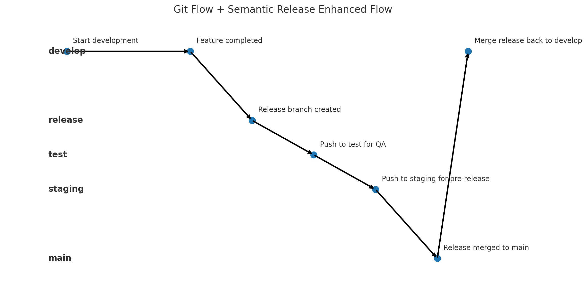

# **Git Flow 指令大全（完整指令整理）** 🚀

Git Flow 是 Git 的一種分支管理策略，它透過 `git-flow` 指令來簡化 **開發 (Feature)**、**發佈 (Release)**、**熱修復 (Hotfix)** 等流程。



------

## **📌 1. 安裝 Git Flow**

### **🔹 Windows**

使用 **Scoop** (推薦)：

```sh
scoop install git-flow-avh
```

使用 **Chocolatey**：

```sh
choco install gitflow-avh -y
```

使用 **Git Bash (手動安裝)**：

```sh
git clone --depth=1 https://github.com/petervanderdoes/gitflow-avh.git
cd gitflow-avh
make install
```

### **🔹 macOS**

使用 **Homebrew (推薦)**

```sh
brew install git-flow-avh
```

使用 **MacPorts**

```sh
sudo port install git-flow
```

### **🔹 Linux (Ubuntu/Debian)**

```sh
sudo apt install git-flow
```

確認安裝成功：

```sh
git flow version
```

------

## **📌 2. 初始化 Git Flow**

Git Flow 需要在 **每個 Git 專案中初始化一次**：

```sh
git flow init
```

你會被問到以下問題，通常可以直接按 **Enter** 接受預設值：

```mathematica
Which branch should be used for production releases?
- main

Which branch should be used for integration of the "next release"?
- develop

Feature branches? (feature/)
Release branches? (release/)
Hotfix branches? (hotfix/)
```

✅ **初始化完成後，會建立 `develop` 分支**，用於日常開發。


------

## **📌 3. 開發新功能 (Feature Branch)**

當你要開發新功能時：

```sh
git flow feature start <feature-name>
```

例如：

```sh
git flow feature start login-page
```

這會： ✅ 建立 `feature/login-page` 分支
 ✅ 自動切換到該分支

🔹 **提交變更**

```sh
git add .
git commit -m "完成登入頁面"
```

🔹 **分享 Feature 分支到遠端**

```sh
git flow feature publish <feature-name>
```

🔹 **其他開發者拉取這個 Feature 分支**

```sh
git flow feature pull origin <feature-name>
```

🔹 **完成功能開發，合併回 `develop`**

```sh
git flow feature finish <feature-name>
```

這會： ✅ 合併 `feature` 到 `develop`
 ✅ 切換回 `develop` 分支
 ✅ **刪除本地 `feature` 分支**

🔹 **推送最新的 `develop` 分支**

```sh
git push origin develop
```

------

## **📌 4. 發佈新版本 (Release Branch)**

當 `develop` 分支的功能準備發佈時：

```sh
git flow release start <version>
```

例如：

```sh
git flow release start v1.0
```

這會： ✅ 建立 `release/v1.0` 分支
 ✅ 讓你可以修正最後的 Bug 或新增說明文件

🔹 **如果需要修正錯誤**

```sh
git add .
git commit -m "修正錯誤"
```

🔹 **完成發佈**

```sh
git flow release finish <version>
```

這會： ✅ 合併 `release/v1.0` 到 `main`
 ✅ **建立 Tag `v1.0`**
 ✅ **合併 `release/v1.0` 到 `develop`** (確保最新的 `develop` 包含這些變更)
 ✅ **刪除 `release/v1.0` 分支**

🔹**推送更新到遠端**

```sh
git push origin main develop --tags
```

🔹**確認分支是否刪除**
```sh
git branch
```

🔹**若本地沒刪除，手動刪除本地分支**
```sh
git branch -D release/v1.0
```


## 🔄 若要保留 test/staging 流程，你有兩個選項

### 選項 1：**修改 git flow 流程順序**

> ❗不要馬上 `git flow release finish`

1. **從 `develop` 開 release 分支**
2. 在 release 分支上做整合測試
   - ✅ 測試通過 → 合併到 `test`
   - ✅ 測試通過 → 合併到 `staging`
   - ✅ 最終通過 → `git flow release finish` → 發佈正式版

這樣 semantic-release 將只會在 `main` 合併後才產生正式版。

👉 這樣你就需要手動管理 release 分支，避免一開始就執行 `git flow release finish`。


------

## **📌 5. 修復緊急 Bug (Hotfix Branch)**

如果 `main` 分支的正式版本有 **重大 Bug**，請使用 **Hotfix** 分支：

```sh
git flow hotfix start <hotfix-name>
```

例如：

```sh
git flow hotfix start fix-login-bug
```

這會： ✅ **從 `main` 建立 `hotfix/fix-login-bug` 分支**

🔹 **修正錯誤後，提交變更**

```sh
git add .
git commit -m "修正登入 Bug"
```

🔹 **完成修正**

```sh
git flow hotfix finish <hotfix-name>
```

這會： ✅ **合併 `hotfix` 到 `main`**
 ✅ **建立 Tag (標記修正版本)**
 ✅ **合併 `hotfix` 到 `develop`** (讓 `develop` 也包含修正)
 ✅ **刪除 `hotfix` 分支**

🔹 **推送更新**

```sh
git push origin main develop --tags
```

------

## **📌 6. 列出當前 Git Flow 分支**

🔹 **查看所有 Feature 分支**

```sh
git flow feature list
```

🔹 **查看所有 Release 分支**

```sh
git flow release list
```

🔹 **查看所有 Hotfix 分支**

```sh
git flow hotfix list
```

------

## **📌 7. 刪除 Git Flow 分支**

🔹 **刪除本地 `feature` 分支**

```sh
git branch -D feature/<feature-name>
```

🔹 **刪除遠端 `feature` 分支**

```sh
git push origin --delete feature/<feature-name>
```

🔹 **刪除本地 `release` 分支**

```sh
git branch -D release/<release-name>
```

🔹 **刪除遠端 `release` 分支**

```sh
git push origin --delete release/<release-name>
```

🔹 **刪除本地 `hotfix` 分支**

```sh
git branch -D hotfix/<hotfix-name>
```

🔹 **刪除遠端 `hotfix` 分支**

```sh
git push origin --delete hotfix/<hotfix-name>
```

------

## **📌 8. 其他實用指令**

🔹 **切換分支**

```sh
git flow feature checkout <feature-name>
git flow release checkout <release-name>
git flow hotfix checkout <hotfix-name>
```

🔹 **檢查 Git Flow 設定**

```sh
git config --list | grep gitflow
```

🔹 **查看 Git Flow 工作流程**

```sh
git log --oneline --decorate --graph --all
```

🔹 **變更 Git Flow 預設編輯器**

```sh
git config --global core.editor "nano"  # 使用 nano
git config --global core.editor "code --wait"  # 使用 VS Code
```

------

## **📌 9. 停止使用 Git Flow**

如果你想以預設值重新初始化 Git Flow：

```sh
git flow init -d
```

或手動刪除 Git Flow 設定：

```sh
git config --remove-section gitflow
```

------

### **🎯 總結**

- **新功能開發** → `git flow feature start/finish`
- **準備發佈** → `git flow release start/finish`
- **修復緊急 Bug** → `git flow hotfix start/finish`
- **查看目前流程** → `git flow feature/release/hotfix list`
- **刪除 Git Flow 分支** → `git branch -D` 或 `git push origin --delete`

這份 **Git Flow 指令大全** 可以幫助你更有效率地管理專案！🚀
 如果有任何問題，歡迎隨時問我 😊

---

## 10. 📌 Git Flow Feature Rebase

`git flow feature rebase` 是 Git Flow 中一個非常實用的指令，主要用途是將 **feature 分支的基礎更新到 develop 的最新狀態**，讓你的開發分支保持在最新狀態，減少日後合併衝突的機率。

------

## 🧩 用途說明

在多人協作開發中，`develop` 分支經常會被其他人更新。如果你從 `develop` 開了一個 feature 分支，在你開發期間，`develop` 可能已經有了很多新的提交。

這時候你可以使用：

```bash
git flow feature rebase
```

或是針對某一個 feature 名稱：

```bash
git flow feature rebase <feature-name>
```

它會幫你做的事是：

1. 切換到該 feature 分支。
2. 將該分支 **rebase 到 develop 的最新版本**。
3. 如果發生衝突，需要你手動解決，然後繼續 rebase。

------

## 📘 使用範例

### 假設你正在開發 `feature/login`：

```bash
git flow feature rebase login
```

這會：

1. 切到 `feature/login` 分支。

2. 執行：

   ```bash
   git fetch origin
   git rebase origin/develop
   ```

3. 幫你整理 commit 順序，讓 `feature/login` 像是「基於最新的 develop 新開的分支」。

####  繼續 rebase

所有衝突都解完並加進暫存區後，執行：

```bash
git rebase --continue
```

------

## ✅ 什麼時候使用？

- 在你開發 feature 的過程中，`develop` 有更新，想要與之同步。
- 在 `git flow feature finish` 前先 rebase，確保整合乾淨。
- 想保持歷史紀錄整潔（比起 `merge`，`rebase` 能避免產生太多無意義的 merge commit）。

------

## ⚠️ 注意事項

- **Rebase 會重寫歷史紀錄**，請避免對 **已 Push 到遠端、多人共用的分支執行 rebase**，否則會造成別人 pull 時出現問題。
- 若你的 feature 分支已經 push 到遠端，請和團隊確認再 rebase。
- 如果不熟悉 conflict 處理，建議改用 `merge`。

---

#### 建立空的Commit

建立一個「內容為空」的 commit（常用於觸發 CI/CD、記錄里程碑或初始化分支等情境），可以使用以下指令：

```bash
git commit --allow-empty -m "你的 commit 訊息"
```

- `--allow-empty`：允許你在沒有任何檔案變更的情況下，強制建立 commit。
- `-m`：指定 commit 訊息。

------

### 範例

1. **在當前分支建立空的 commit**

   ```bash
   git checkout feature/x
   git commit --allow-empty -m "初始化 feature/x 分支"
   ```

2. **搭配標籤（Tag）**
    如果想要在空 commit 上打標籤，例如做為版本起點：

   ```bash
   git commit --allow-empty -m "start v2.0.0"
   git tag -a v2.0.0 -m "版本 2.0.0 起點"
   git push origin feature/x --follow-tags
   ```

3. **再追加一個空 commit**
    有時候你想在上一個 commit 後再加一個空 commit，可以用：

   ```bash
   git commit --allow-empty -m "再加一個空 commit"
   ```

------

### 進階：使用 `git commit-tree`

如果你需要更底層的方式，也可以透過樹狀物件（tree object）直接建立空 commit：

```bash
# 1. 取得目前 HEAD 指向物件的 tree
TREE=$(git rev-parse HEAD^{tree})

# 2. 建立一個空 commit
git commit-tree $TREE -p HEAD -m "底層建立空 commit"
# 這會輸出新 commit 的 SHA

# 3. 切換分支到這個新 commit（假設 SHA 為 abc1234）
git reset --hard abc1234
```

不過一般日常使用建議還是以 `git commit --allow-empty` 最為簡潔。

------

