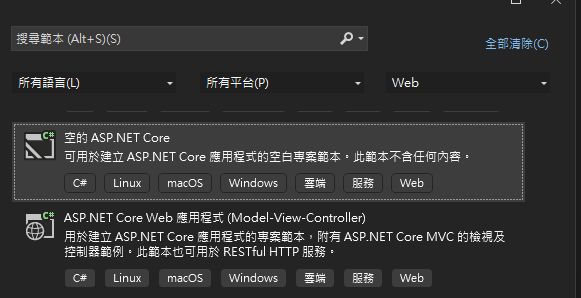
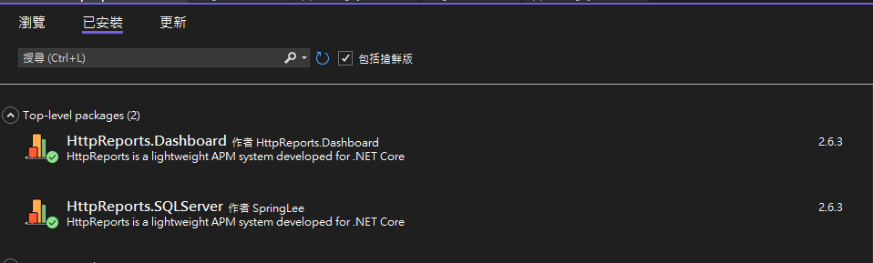
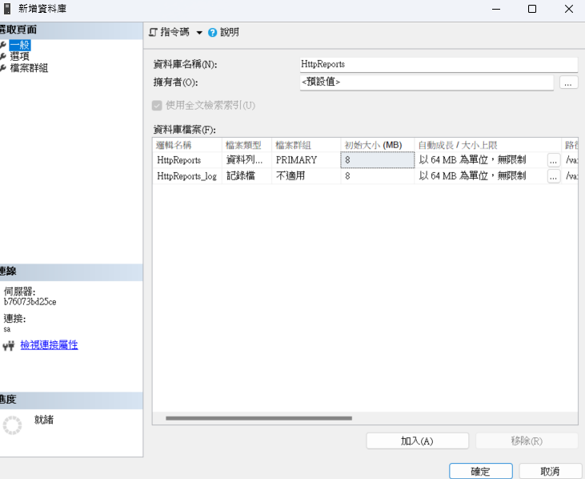
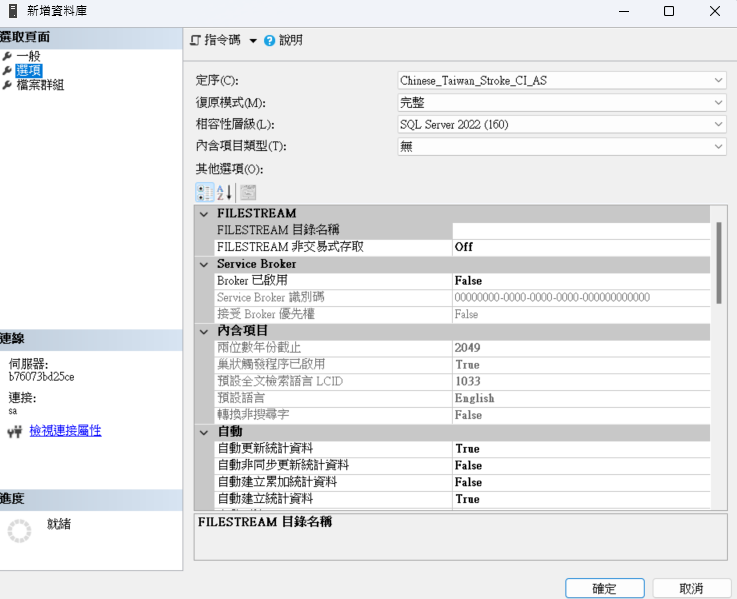
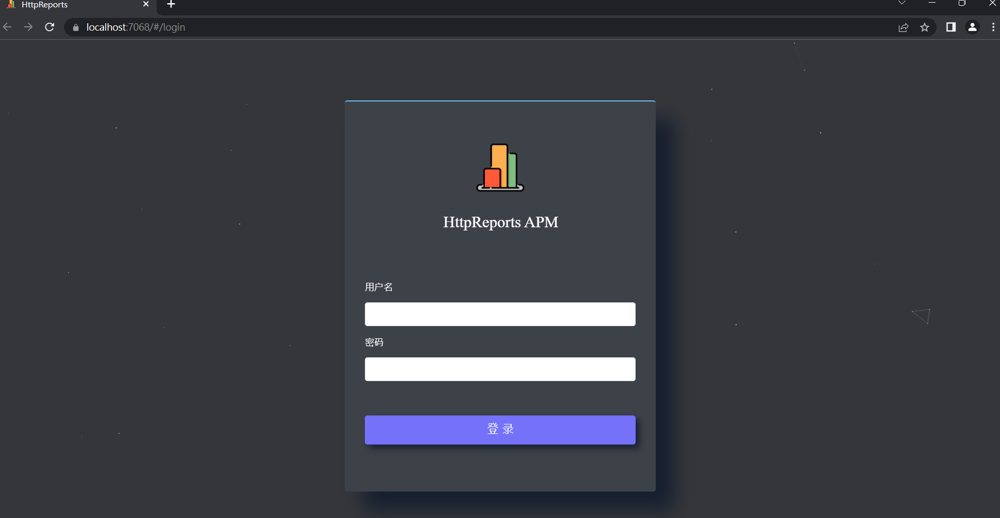
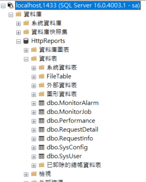
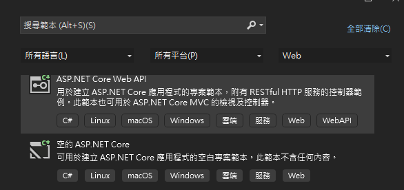
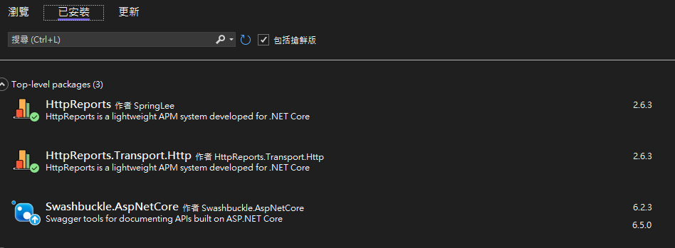
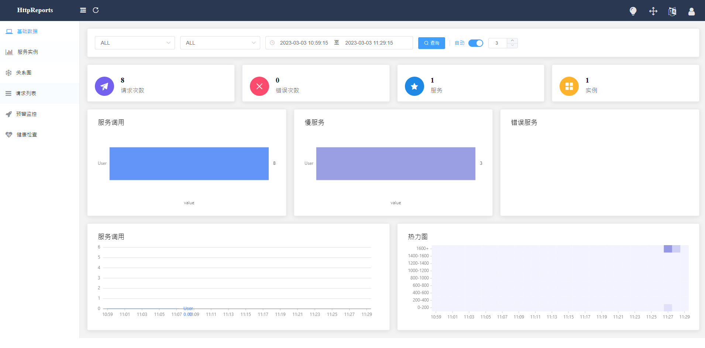

# ASP.NET Core 中使用 HttpReports 進行接口統計，分析, 可視化， 監控，追踪等

HttpReports 基於.NET Core 開發的APM監控系統，使用MIT開源協議，主要功能包括，統計, 分析, 可視化， 監控，追踪等，適合在微服務環境中使用。

`HttpReports` 基於`.NET Core` 開發的`APM`監控系統，使用`MIT`開源協議，主要功能包括，統計, 分析, 可視化， 監控，追踪等，適合在微服務環境中使用。

官方地址：https://www.yuque.com/httpreports/docs/uyaiil

**主要功能**

- 接口調用指標分析
- 多服務節點數據聚合分析
- 慢請求，錯誤請求分析
- 接口調用日誌查詢
- 多類型預警監控
- HTTP,Grpc 調用分析
- 分佈式追踪
- 多數據庫支持，集成方便
- 程序性能監控

## 建立空專案
---
打開 VS 新建.NET項目我這裡用的是`空的 ASP.NET Core ` 進行演示


## 安裝 NuGet 套件
---
使用`Nuget`安裝`MHttpReports.Dashboard`包和`HttpReports.SqlServer`



## 配置 appsetting.json
---
配置 appsetting.json

```json
{
  "HttpReportsDashboard": {
    "ExpireDay": 3,
    "Storage": {
      "ConnectionString": "Server=localhost,1433;Database=HttpReports;User Id=sa;Password=!QAZ2wsx;",
      "DeferSecond": 10,
      "DeferThreshold": 100
    },
    "Check": {
      "Mode": "Self",
      "Switch": true,
      "Endpoint": "",
      "Range": "500,2000"
    },
    "Mail": {
      "Server": "smtp.163.com",
      "Port": 465,
      "Account": "HttpReports@qq.com",
      "Password": "*******",
      "EnableSsL": true,
      "Switch": true
    }
  }
}
```

**參數介紹：**

- ExpireDay - 數據過期天數，默認3天，HttpReports 會自動清除過期的數據
- Storage - 存儲信息
- DeferSecond - 批量數據入庫的秒數，建議值5-60
- DeferThreshold - 批量數據入庫的數量，建議值100-1000
- Mail - 郵箱信息，配置監控的話，可以發告警郵件
- Check - 健康檢查配置，具體看健康檢查頁面

## 配置 Program.cs
---
配置 Program.cs

```c#
var builder = WebApplication.CreateBuilder(args);

// HttpReports
builder.Services.AddHttpReportsDashboard().AddSQLServerStorage();

var app = builder.Build();

// HttpReports
app.UseHttpReportsDashboard();

app.MapGet("/", () => "Hello World!");

app.Run();
```

## 建立資料庫
---
建立資料庫




## 啟動專案
---
把Dashboard 程式啟動起來，如果沒有問題的話，會跳轉到Dashboard的登入頁面


自動產生資料表


```
默認帳號：admin 
密碼: 123456
```

現在Dashboard 可視化有了，但是沒有數據，我們還需要給服務端程序，添加HttpReports 來收集信息。

## 建立 WebAPI 專案

新建一個 WebAPI 專案



## 安裝 NuGet 套件
---
使用`Nuget`安裝`HttpReports`，`HttpReports.Transport.Http`



## 配置 appsetting.json

修改Services的`appsettings.json` 簡單配置一下

```json
{
  "HttpReports": {
    "Transport": {
      "CollectorAddress": "https://localhost:7068/",
      "DeferSecond": 10,
      "DeferThreshold": 100
    },
    "Server": "https://localhost:7250",
    "Service": "User",
    "Switch": true,
    "RequestFilter": [ "/api/health/*", "/HttpReports*" ],
    "WithRequest": true,
    "WithResponse": true,
    "WithCookie": true,
    "WithHeader": true
  }
}
```

**參數介紹：**
- Transport -
- CollectorAddress - 數據發送的地址，配置Dashboard 的項目地址即可 (主要的 HttpReports 站台)
- DeferSecond - 批量數據入庫的秒數，建議值5-60
- DeferThreshold - 批量數據入庫的數量，建議值100-300
- Server - 服務的地址 (被監控的站台),
- Service - 服務的名稱
- Switch - 是否開啟收集數據
- RequestFilter - 數據過濾，用* 來模糊匹配
- WithRequest - 是否記錄接口的入參
- WithResponse - 是否記錄接口的出參
- WithCookie - 是否記錄Cookie 信息
- WithHeader - 是否記錄請求Header信息

## 配置 Program.cs

我們接著修改UserService 項目的 `Program.cs` 文件

`app.UseHttpReports();`這一行最好放到Configure 方法最上面

```c#
var builder = WebApplication.CreateBuilder(args);

// Add services to the container.

// HttpReports
builder.Services.AddHttpReports().AddHttpTransport();

builder.Services.AddControllers();
// Learn more about configuring Swagger/OpenAPI at https://aka.ms/aspnetcore/swashbuckle
builder.Services.AddEndpointsApiExplorer();
builder.Services.AddSwaggerGen();

var app = builder.Build();

// HttpReports
app.UseHttpReports();

// Configure the HTTP request pipeline.
if (app.Environment.IsDevelopment())
{
    app.UseSwagger();
    app.UseSwaggerUI();
}

app.UseHttpsRedirection();

app.UseAuthorization();

app.MapControllers();

app.Run();
```

刷新下UserService 的接口，再回到`Dashboard`的頁面上面，已經可以看到數據了



## 總結

本篇博客描述了使用HttpReports進行接口統計，分析, 可視化， 監控，追踪等, 如果覺得還不錯，請給個關注。