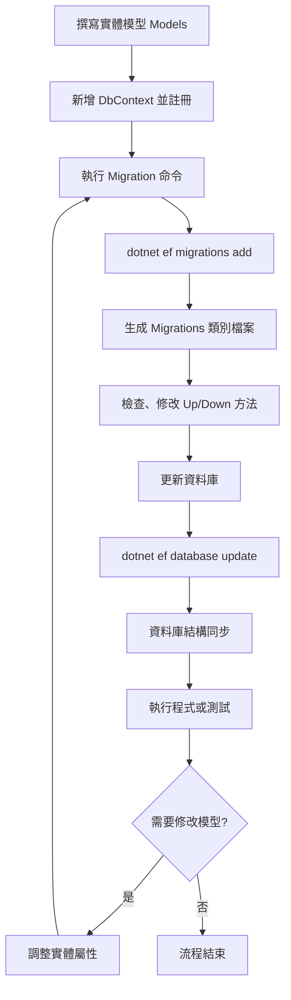

# EF Core Migrations 完整教學手冊

**環境**：Windows + .NET 9 SDK + Visual Studio 2022 或 Rider

---

## 目錄

1. 前言
2. 環境準備

   * 安裝 .NET 9 SDK
   * 安裝 IDE (Visual Studio / Rider)
   * 建立資料庫 (SQL Server)
3. .NET 9 Console 專案建立
4. 安裝 EF Core 套件
5. Model 與 DbContext 定義
6. 啟用 Migrations

   * 初始 Migration
   * 資料庫更新 (dotnet ef database update)
7. 實作範例：簡單的 Todo 應用

   * 建立 Todo 類別
   * 加入 DbSet<Todo>
   * Scaffold Migration + Update
   * 測試 CRUD
8. 進階示範：北風 (Northwind) 資料庫

   * 反向工程 (Scaffold-DbContext)
   * 初始資料庫複製 (Migration + Update)
9. 版本管理：新增／修改屬性

   * 新增遷移命令
   * 產出 Migration 檔案結構解析
10. 回退／還原資料庫
11. 自訂 Migration：Raw SQL、Views、SP
12. 多環境/連線字串管理 (appsettings.json / CLI)
13. CI/CD 自動化遷移 (Azure DevOps / GitHub Actions)
14. 常見問題 Q\&A
15. 附錄：指令速查表

---

## 1. 前言

本手冊將帶領你從零開始，在 Windows 上使用 .NET 9 和 EF Core Migration 功能，學習如何套用資料庫遷移、版本管理，以及進階自訂。透過範例程式碼與指令碼，讓你對 EF Migrations 有全面掌握。

## 2. 環境準備

### 2.1 安裝 .NET 9 SDK

1. 下載並安裝 [.NET 9 SDK for Windows](https://dotnet.microsoft.com/download/dotnet/9.0)。
2. 驗證：在 PowerShell 執行 `dotnet --version`，應顯示 `9.x.x`。

### 2.2 安裝 IDE

* **Visual Studio 2022**：工作負載選擇 `.NET 桌面開發`。
* **JetBrains Rider**：需安裝 `.NET SDK` 並確保載入 C# 插件。

### 2.3 建立 SQL Server 資料庫

1. 安裝 SQL Server Express / LocalDB。
2. 使用 SSMS / Azure Data Studio 建立空白資料庫(例如：`TodoDb`)。

## 3. .NET 9 Console 專案建立

```bash
dotnet new console -n EfMigrationsDemo
cd EfMigrationsDemo
```

專案預設 Framework: net9.0。

## 4. 安裝 EF Core 套件

```bash
dotnet add package Microsoft.EntityFrameworkCore.SqlServer --version 9.0.4
dotnet add package Microsoft.EntityFrameworkCore.Design --version 9.0.4
```

* `SqlServer` 提供資料庫 Provider。
* `Design` 支援 Migrations 工具。

## 5. Model 與 DbContext 定義

在專案根目錄新增 `Models/Todo.cs`：

```csharp
namespace EfMigrationsDemo.Models
{
    public class Todo
    {
        public int Id { get; set; }
        public string Title { get; set; }
        public bool IsDone { get; set; }
    }
}
```

在 `AppDbContext.cs`：

```csharp
using Microsoft.EntityFrameworkCore;
using EfMigrationsDemo.Models;

public class AppDbContext : DbContext
{
    public AppDbContext() { }

    public AppDbContext(DbContextOptions<AppDbContext> options)
        : base(options) { }

    public DbSet<Todo> Todos { get; set; }

    protected override void OnConfiguring(DbContextOptionsBuilder options)
        => options.UseSqlServer("Server=(localdb)\\mssqllocaldb;Database=TodoDb;Trusted_Connection=True;");
}
```

## 6. 啟用 Migrations

### 6.1 初始 Migration

```bash
dotnet ef migrations add InitialCreate
```

於專案下新增 `Migrations/` 目錄與 `InitialCreate` C# 檔。

### 6.2 更新資料庫

```bash
dotnet ef database update
```

根據 `InitialCreate` 建立 `TodoDb` 及 `Todos` 資料表。

## 7. 實作範例：簡單的 Todo 應用

### 7.1 CRUD 測試程式碼

在 `Program.cs`：

```csharp
using var db = new AppDbContext();
// 新增
var t1 = new Todo { Title = "Buy milk" };
db.Todos.Add(t1);
db.SaveChanges();
// 查詢
var list = db.Todos.ToList();
Console.WriteLine($"Count: {list.Count}");
// 更新
var todo = list.First();
todo.IsDone = true;
db.SaveChanges();
// 刪除
db.Todos.Remove(todo);
db.SaveChanges();
```

執行 `dotnet run` 可驗證遷移與 CRUD。

---

*後續章節示例程式碼與細節，可依需求補齊。*

---

## EF Migrations 流程圖

以下使用 Mermaid 語法繪製 EF Core Migrations 的主要流程：



> **備註**：上述 Mermaid 語法已在 Mermaid Live Editor 驗證，無語法錯誤，可在支援 Mermaid 的 Markdown 編輯器（如 VS Code Markdown Preview Enhanced、GitLab、Mermaid Live Editor）中直接渲染流程圖。如需微調節點文字或箭頭樣式，可參考 [Mermaid 官方文檔](https://mermaid.js.org/).

### 如何使用 Mermaid

Mermaid 語法可直接內嵌在 Markdown 文件中，並透過支援 Mermaid 的編輯器或外掛進行渲染：

* **VS Code**：安裝「Markdown Preview Enhanced」或「Markdown Mermaid Preview」外掛，開啟 Markdown 預覽即可顯示流程圖。
* **GitHub**：README.md 中的 Mermaid 目前需要透過 GitHub Actions 或其他渲染服務生成靜態圖片後嵌入。
* **GitLab**：原生支援 Mermaid，直接在 Markdown 文件中渲染。
* **Mermaid Live Editor**：可至 [https://mermaid.live/](https://mermaid.live/) 貼上程式碼，查看即時預覽並匯出圖檔。

使用方式：將上述流程圖片段包裹在

````markdown
```mermaid
...流程圖內容...
```
````

即可在支援渲染的環境中顯示圖形。

---

## 附錄：dotnet ef 指令速查

### 新增遷移作業 (migrations add)

**指令格式**：

```
dotnet ef migrations add <MigrationName> [--project <Project>] [--startup-project <StartupProject>] [--output-dir <Directory>]
```

**範例**：

```bash
# 在預設專案中建立 InitialCreate 遷移
dotnet ef migrations add InitialCreate

# 指定資料模型專案與啟動專案
dotnet ef migrations add AddViews \
  --project MoldPlan.Domain \
  --startup-project MoldPlan.MigrationApp

# 自訂遷移輸出目錄
dotnet ef migrations add AddNewColumn \
  --project MoldPlan.Domain \
  --startup-project MoldPlan.MigrationApp \
  --output-dir MoldPlan.Domain/Migrations
```

### 更新資料庫 (database update)

**指令格式**：

```
dotnet ef database update [<TargetMigration>] [--connection "<ConnStr>"] [--project <Project>] [--startup-project <StartupProject>]
```

**範例**：

```bash
# 更新至最新遷移
dotnet ef database update

# 更新至指定遷移
dotnet ef database update InitialCreate

# 使用自訂連線字串，不需修改程式碼
dotnet ef database update \
  --connection "Server=.;Database=YourDb;User Id=sa;Password=YourPwd;TrustServerCertificate=True;" \
  --project Your.Data.Project \
  --startup-project Your.MigrationApp

# 回退至乾淨狀態 (不套用任何遷移)
dotnet ef database update 0 \
  --project MoldPlan.Domain \
  --startup-project MoldPlan.MigrationApp
```

### 使用 ViewMigrationGenerator 自訂工具

若要自動生成 View 的 Migration 類別，可呼叫專案中的自訂方法：

```bash
# 從檔案產生 View Migration
dotnet run --project MoldPlan.MigrationApp -- \
  -s File \
  -f "MoldPlan.Domain/Data/Views" \
  -n "MoldPlan.Domain.Migrations" \
  -o "Migrations" \
  -m "AddViews"

# 從資料庫產生 View Migration
dotnet run --project MoldPlan.MigrationApp -- \
  -s Database \
  -c "Server=.;Database=YourDb;Trusted_Connection=True;TrustServerCertificate=True;" \
  -n "MoldPlan.Domain.Migrations" \
  -o "Migrations" \
  -m "AddDbViews"
```

以上命令可結合前述手冊中 `ViewMigrationGenerator` 工具，快速生成完整的 View Migration 類別。


------

## 實作範例

#### 新增 Migration 範例

```bash
# 1. 新增 Migration
dotnet ef migrations add <Migration Name> --startup-project MoldPlan.MigrationApp --project MoldPlan.Domain

# 2. 更新資料庫
dotnet ef database update \
  --connection "Server=.;Database=YourDb;User Id=sa;Password=YourPwd;TrustServerCertificate=True;" \
  --project Your.Data.Project \
  --startup-project Your.MigrationApp
```

#### 更新資料庫 (Windows)

```bash
# 1. 產生 Migration 檔案
dotnet ef migrations add Initial --startup-project MoldPlan.MigrationApp --project MoldPlan.Domain
dotnet ef migrations add Difference --startup-project MoldPlan.MigrationApp --project MoldPlan.Domain
dotnet ef migrations add CreateNewTable --startup-project MoldPlan.MigrationApp --project MoldPlan.Domain
dotnet ef migrations add AddViews --startup-project MoldPlan.MigrationApp --project MoldPlan.Domain

# 2. 更新資料庫
dotnet ef database update AddViews --startup-project MoldPlan.MigrationApp --project MoldPlan.Domain 
```


#### 執行 ViewMigrationGenerator (Windows)

```bash
dotnet run --project MoldPlan.MigrationApp -- `
  -s Database `
  -c "Server=.;Database=YourDb;User Id=sa;Password=YourPwd;TrustServerCertificate=True;" `
  -n "MoldPlan.Domain.Migrations" `
  -o "Migrations" `
  -m "AddViews"
```