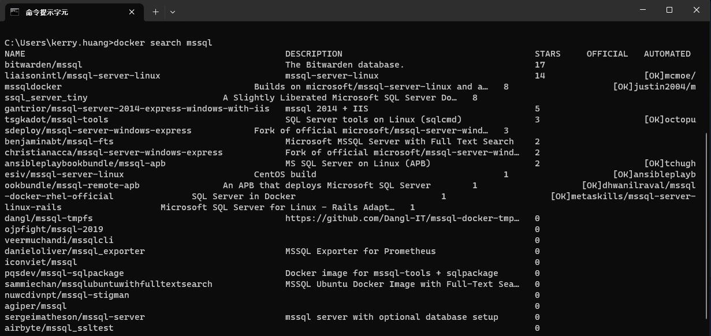
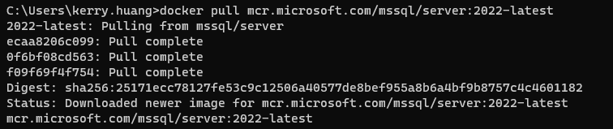
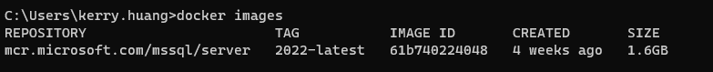
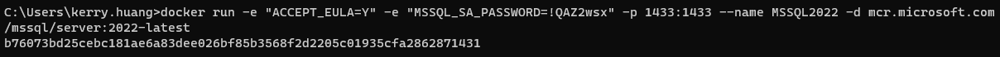
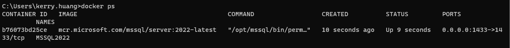
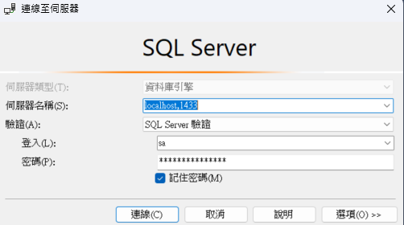
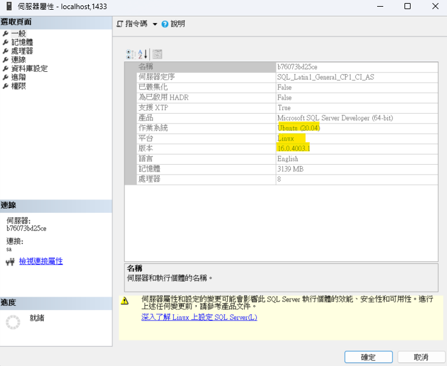

# Docker - 第三章 | 安裝 MSSQL

---

在Windows 環境建立MSSQL。

開始前需先下載Docker Desktop on window，參考[連結](https://dotblogs.com.tw/rexhuang/2020/03/07/223552)
[官方教學](https://hub.docker.com/_/microsoft-mssql-server)

## 搜尋 Image
---

```
docker search mssql
```



在Docker Hub搜尋mssql都找不到Microsoft官方的image，後來直接用 Google 搜詢 [docker mssql image]就有了。

## 拉取 Image
---

```
docker pull mcr.microsoft.com/mssql/server:2022-latest
```



## 查看 Image
---
```
docker images
```



## 執行 Image
---
 (為了方便閱讀下面的程式碼有換行 要貼到命令提示字元前請把換行刪除哦!)

```
docker run -e "ACCEPT_EULA=Y" 
-e "MSSQL_SA_PASSWORD=需要輸入一個超級困難的密碼" 
-p 1433:1433 
--name 輸入你的container名稱(當然是要英文來者)  
-d mcr.microsoft.com/mssql/server:2022-latest 
```

* -e ACCEPT_EULA=Y : 設定環境中授權條款同意書 ( Y )
* -e "MSSQL_SA_PASSWORD：需要輸入一個超級困難的密碼" : 請輸入一個Really Strong PWD
* -p 1433:1433 ：設定連線埠號，那為什麼有兩個呢？因為第一個是你本機的另外一個是Container的
* --name：輸入你的container名稱啦！！！
* -d microsoft/mssql-server-linux (Linux)：-d 是run container background 好了之後show container ID給我就好的意思 後面的就是IMAGE名稱啦
* -d mcr.microsoft.com/mssql/server:2022-latest (Windows)



[Windows]
```
docker run -e "ACCEPT_EULA=Y" -e "MSSQL_SA_PASSWORD=!QAZ2wsx" -p 1433:1433 --name mssql -d mcr.microsoft.com/mssql/server:2022-latest
```

```
docker run -d --name mssql `
  -e "ACCEPT_EULA=Y" `
  -e "MSSQL_SA_PASSWORD=!QAZ2wsx" `
  -e "MSSQL_COLLATION=Chinese_Taiwan_Stroke_CI_AS" `
  -e "MSSQL_AGENT_ENABLED=true" `
  -p 1433:1433 `
  --restart always `
  -v D:\Database\mssql\backup:/var/opt/mssql/backup `
  -v D:\docker\mssql\data:/var/opt/mssql/data `
  mcr.microsoft.com/mssql/server:2022-latest
```

[Mac]
```
docker run -e "ACCEPT_EULA=Y" -e "MSSQL_SA_PASSWORD=\!QAZ2wsx" -p 1433:1433 --name mssql -d mcr.microsoft.com/mssql/server:2022-latest
```

### 容器配置
---

#### Requirements
---

```no-highlight

* This image requires Docker Engine 1.8+ in any of their supported platforms.

* At least 2GB of RAM (3.25 GB prior to 2017-CU2). Make sure to assign enough memory to the Docker VM if you're running on Docker for Mac or Windows.

* Requires the following environment flags
"ACCEPT_EULA=Y"
"MSSQL_SA_PASSWORD="
"MSSQL_PID=(default: Developer)"

* A strong system administrator (SA) password: At least 8 characters including uppercase, lowercase letters, base-10 digits and/or non-alphanumeric symbols.
```

#### Environment Variables
---

```no-highlight
You can use environment variables to configure SQL Server on Linux Containers.

ACCEPT_EULA
confirms your acceptance of the End-User Licensing Agreement.

MSSQL_SA_PASSWORD
is the database system administrator (userid = 'sa') password used to connect to SQL Server once the container is running. Important note: This password needs to include at least 8 characters of at least three of these four categories: uppercase letters, lowercase letters, numbers and non-alphanumeric symbols.

MSSQL_PID
is the Product ID (PID) or Edition that the container will run with. Acceptable values:

* Developer : This will run the container using the Developer Edition (this is the default if no MSSQL_PID environment variable is supplied)
* Express : This will run the container using the Express Edition
* Standard : This will run the container using the Standard Edition
* Enterprise : This will run the container using the Enterprise Edition
* EnterpriseCore : This will run the container using the Enterprise Edition Core

For a complete list of environment variables that can be used, refer to the documentation here.
```

## 查看 Container
---
```
docker ps
```


## 刪除Container 
---
(不想重做Container可以跳過) 

建立Container先停止運行中的Container

```
docker stop [Container ID]
```

刪除Container

```
docker rm [Container ID]
```

重新查詢一次Container，目前已經沒有了


## 登入管理介面

使用SSMS測試連線

---
```
http://localhost:1433/ 預設用戶/密碼：sa/******
```




連線成功了