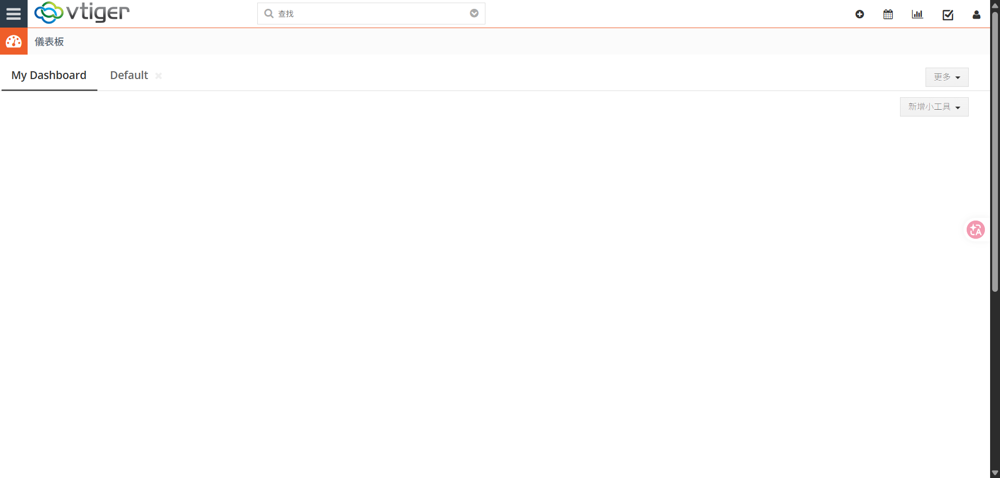
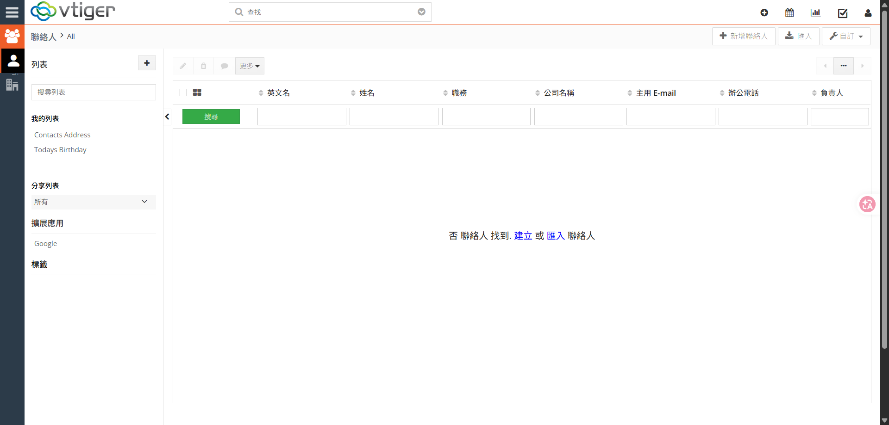
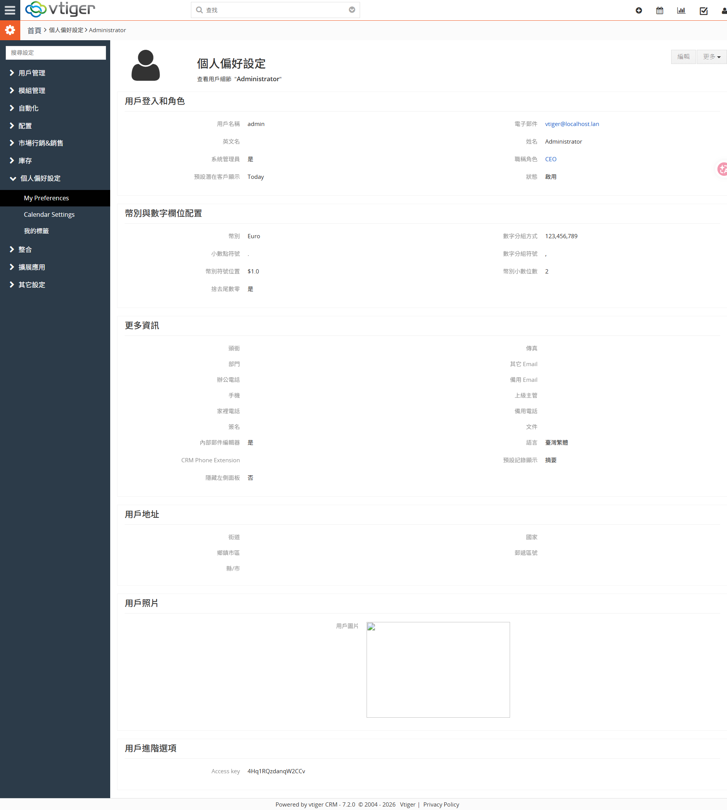

# Docker - 第十一章 | 安裝 VtigerCRM（含繁體中文語系）

VtigerCRM 是一套開源(Open Source)的客戶關係管理系統，涵蓋銷售、行銷、客服、報價/訂單、庫存、專案等模組，功能完整且可自行架設。本章以 **Docker Compose** 在本機建置一套**可登入、且介面為繁體中文**的 VtigerCRM 測試環境，並完整說明語系更換流程與常見地雷。

> 本章實測環境：Windows 11 + Docker Desktop（Docker Compose v2）。指令以 PowerShell 為主。

---

## 一、版本與方案說明（先讀，少踩雷）

| 項目 | 選擇 | 原因 |
|------|------|------|
| Vtiger 版本 | **7.x（映像實際為 7.2.0）** | 官方最新開源 8.2.0 **沒有可用的繁體中文語言包**；成熟的社群繁中包只支援 7.x。要繁中介面就用 7.x。 |
| 映像來源 | `javanile/vtiger:7.2.0` | 社群維護、可自動匯入資料庫、`admin/admin` 自動建立。 |
| 資料庫 | 獨立 `mysql:5.7` 容器 | 7.x 全包式映像已不可靠，改用 app + DB 兩容器較穩。 |
| 繁中語言包 | GitHub `fanyuan0912/vtiger_zh_tw_Lang` | vtiger 7.x 專用，`prefix=zh_tw`、標籤「臺灣繁體」。 |

兩個必知重點（後面有對應步驟）：

1. **重啟會卡在 loading**：javanile 映像的啟動腳本在「資料庫已匯入」時會鬼打牆（無限等待空資料庫），導致 `restart` 後卡住。本章提供啟動腳本補丁解決。
2. **改了語言卻沒生效**：vtiger 會把使用者資料**快取**在 `user_privileges/user_privileges_<id>.php`，只改資料庫沒用，**必須一併改快取**。

---

## 二、前置需求

- 已安裝 **Docker Desktop** 並**確認引擎已啟動**（右下角鯨魚圖示為綠色）。
  驗證：
  ```powershell
  docker version
  docker compose version
  ```

---

## 三、建立專案檔

任選一個工作資料夾（例如 `D:\docker\vtiger`），建立 `docker-compose.yml`：

```yaml
services:
  vtiger:
    image: javanile/vtiger:7.2.0
    container_name: vtiger
    environment:
      - VT_SITE_URL=http://localhost:8080/
      - MYSQL_HOST=mysql
      - MYSQL_DATABASE=vtiger
      - MYSQL_ROOT_PASSWORD=secret
    ports:
      - "8080:80"
    depends_on:
      - mysql

  mysql:
    image: mysql:5.7
    container_name: vtiger-mysql
    command: --sql-mode=""        # vtiger 7.x 需要關閉 STRICT 模式
    environment:
      - MYSQL_DATABASE=vtiger
      - MYSQL_ROOT_PASSWORD=secret
```

> `--sql-mode=""` 是關鍵：MySQL 5.7 預設的嚴格模式會讓 vtiger 匯入/寫入出錯。

---

## 四、啟動與登入

於 `docker-compose.yml` 所在資料夾執行：

```powershell
docker compose up -d
```

第一次會拉映像並**自動匯入資料庫**，約需 1～2 分鐘。可觀察進度：

```powershell
docker logs -f vtiger
```

看到 `Run main process...` 與 `apache2 -D FOREGROUND ... resuming normal operations` 即代表完成。

打開瀏覽器：

```
http://localhost:8080
```

7.x 版為**自動安裝**（不需安裝精靈），直接以下列帳密登入：

| 項目 | 值 |
|------|----|
| 帳號 | **admin** |
| 密碼 | **admin** |

完成繁中設定後，登入即為繁體中文介面（儀表板、查找、新增小工具…）：



> 驗證資料庫已完整匯入（應約 520+ 張表、admin 帳號存在）：
> ```powershell
> docker exec -i vtiger-mysql mysql -uroot -psecret vtiger -e "SELECT COUNT(*) AS tables FROM information_schema.tables WHERE table_schema='vtiger'; SELECT id,user_name,is_admin,status FROM vtiger_users;"
> ```

---

## 五、套用「重啟安全」補丁（強烈建議）

不打這個補丁，`docker compose restart` / `stop`+`start` 後會**卡在 loading 畫面**。

**1. 在工作資料夾建立 `vtiger-foreground.sh`**（內容見本章附錄），重點是把「匯入資料庫」那段改成「資料庫已匯入就跳過」。

**2. 複製進容器並修正、套用：**

```powershell
docker cp .\vtiger-foreground.sh vtiger:/usr/local/bin/vtiger-foreground.sh
docker exec vtiger sh -c "sed -i 's/\r$//' /usr/local/bin/vtiger-foreground.sh && chmod +x /usr/local/bin/vtiger-foreground.sh && bash -n /usr/local/bin/vtiger-foreground.sh && echo OK"
```

> `sed -i 's/\r$//'` 是清掉 Windows 換行(CRLF)，否則容器內 bash 會執行失敗。看到 `OK` 表示語法正確。

**3. 驗證重啟不再卡：**

```powershell
docker compose restart vtiger
docker logs vtiger | Select-String "Database already imported"
```

看到 `Database already imported, skipping import.` 即代表補丁生效。

> 此補丁存在容器層：`restart`/`stop`+`start` 都會保留；只有 `docker compose down`（整個重建）會還原，但那時資料庫也是全新空的，會走正常匯入，一樣沒問題。

---

## 六、更換繁體中文語系（本章重點）

整體流程：**下載語言包 → 放進語系資料夾 → 在資料庫註冊語言 → 設定使用者語言並清快取 → 驗證**。

### 6-1. 下載語言包

在工作資料夾：

```powershell
git clone --depth 1 https://github.com/fanyuan0912/vtiger_zh_tw_Lang.git zh_tw_pack
```

語言包結構（重點）：
- `modules\*.php` → 對應 `languages/zh_tw/*.php`（各模組翻譯）
- `modules\Settings\*.php` → 對應 `languages/zh_tw/Settings/*.php`
- `cron\language\phpmailer.lang-zh_tw.php` → cron 寄信語系（次要）

### 6-2. 放置語言檔到容器

vtiger 的 `languages/` 是指向 `/var/lib/vtiger/languages` 的 symlink，**檔案要放到 `/var/lib/vtiger/languages/zh_tw`**。

```powershell
# 先把語言包資料夾複製進容器暫存區
docker cp .\zh_tw_pack\modules vtiger:/tmp/zhpack_modules
docker cp .\zh_tw_pack\cron    vtiger:/tmp/zhpack_cron

# 在容器內組成 languages/zh_tw 結構並設定權限
docker exec vtiger bash -c '
set -e
DEST=/var/lib/vtiger/languages/zh_tw
mkdir -p "$DEST/Settings"
cp /tmp/zhpack_modules/*.php          "$DEST/"
cp /tmp/zhpack_modules/Settings/*.php "$DEST/Settings/"
[ -d /var/www/html/cron/language ] && cp /tmp/zhpack_cron/language/*.php /var/www/html/cron/language/ 2>/dev/null || true
chown -R www-data:www-data "$DEST"
echo "root=$(ls "$DEST"/*.php | wc -l) settings=$(ls "$DEST"/Settings/*.php | wc -l)"
'
```

看到類似 `root=47 settings=22` 即代表語言檔就位。

### 6-3. 在資料庫註冊「臺灣繁體」

vtiger 從 `vtiger_language` 資料表決定可選語言。建立一個 UTF-8 的 `zh_tw.sql`：

```sql
SET NAMES utf8;
DELETE FROM vtiger_language WHERE prefix='zh_tw';
INSERT INTO vtiger_language (id, name, prefix, label, lastupdated, sequence, isdefault, active)
VALUES (17, 'Traditional Chinese', 'zh_tw', '臺灣繁體', NOW(), 17, 0, 1);
```

> `id` 取現有最大值 +1（預設 16 個語言，故用 17）；`active=1` 表示啟用。

匯入（用檔案轉向，避免 PowerShell 中文編碼問題）：

```powershell
Get-Content .\zh_tw.sql -Encoding UTF8 | docker exec -i vtiger-mysql mysql -uroot -psecret --default-character-set=utf8 vtiger
docker exec -i vtiger-mysql mysql -uroot -psecret vtiger -e "SELECT id,name,prefix,label,active FROM vtiger_language WHERE prefix='zh_tw';"
```

### 6-4. 設定使用者語言 **並清快取**（關鍵步驟）

只改資料庫的 `vtiger_users.language` 是**不夠**的——vtiger 會讀 `user_privileges/user_privileges_<id>.php` 這份快取，裡面也有 `language` 欄位，會蓋過資料庫。**兩者都要改**。

以 admin（id=1）為例：

```powershell
# (1) 改資料庫
docker exec -i vtiger-mysql mysql -uroot -psecret vtiger -e "UPDATE vtiger_users SET language='zh_tw' WHERE user_name='admin';"

# (2) 改使用者快取檔（最關鍵，沒這步介面不會變中文）
docker exec vtiger sed -i "s/'language'=>'en_us'/'language'=>'zh_tw'/" /var/www/html/user_privileges/user_privileges_1.php

# (3) 清模板快取
docker exec vtiger sh -c "rm -rf /var/www/html/cache/templates_c/* 2>/dev/null; echo cleared"
```

> 若想讓**系統預設**語言（含新使用者、登入前）也是繁中，可另外把 `config.inc.php` 的 `$default_language` 改成 `zh_tw`，並重啟容器讓 PHP opcache 失效：
> ```powershell
> docker exec vtiger sed -i 's/\$default_language = .*/\$default_language = "zh_tw";/' /var/www/html/config.inc.php
> docker compose restart vtiger
> ```

### 6-5. 驗證

重新登入 `http://localhost:8080`（admin/admin），介面即為繁體中文：儀表板、聯絡人、客戶、日曆、設定、模組管理、垃圾桶……皆中文化。各模組清單頁的選單、欄位、按鈕也都已中文化：



也可用指令快速驗證頁面已中文化：

```powershell
# 登入後抓「我的偏好設定」頁，統計中文詞數（應有上百個）
docker exec vtiger php -r '$languageStrings=array(); require "/var/www/html/languages/zh_tw/Vtiger.php"; echo "Vtiger.php 翻譯條數=".count($languageStrings)." 範例 LBL_NEW=".$languageStrings["LBL_NEW"]."\n";'
```

### 6-6. 其他使用者改中文（一般操作）

登入後 →「**我的偏好設定（My Preferences）**」→ **Language** → 選「**臺灣繁體**」→ 儲存。
（透過 UI 變更時，vtiger 會自行更新該使用者的快取，不必手動改檔。）

「我的偏好設定」頁面，語言欄位顯示「臺灣繁體」：



---

## 七、日常維運指令

於 `docker-compose.yml` 所在資料夾執行：

```powershell
docker compose stop      # 暫停（保留資料與繁中設定）
docker compose start     # 恢復
docker compose restart   # 重啟（已套用補丁，不會卡 loading）
docker logs -f vtiger    # 看 vtiger 日誌
docker compose down      # ⚠ 整個刪除：資料與繁中設定全清空；下次 up 為全新英文實例
```

> 本章為**測試用途、未掛持久化磁碟區(volume)**。資料存在容器層：`stop`/`start`/`restart` 會保留；`down` 會清空。若需長期保留，請另外為 `mysql` 服務加上 named volume（例如 `- mysql_data:/var/lib/mysql`）。

---

## 八、疑難排解

| 症狀 | 原因 | 解法 |
|------|------|------|
| 重啟後一直停在 loading 畫面 | 啟動腳本在 DB 已匯入時無限等待空資料庫 | 套用第五章補丁；或 `docker compose down` 後重新 `up` |
| 改了語言但介面還是英文 | `user_privileges/user_privileges_<id>.php` 快取未更新 | 執行 6-4 的步驟 (2) 改快取檔 |
| 改 `config.inc.php` 沒生效 | PHP opcache 快取了舊設定 | `docker compose restart vtiger` |
| 登入頁(Username/Password/Sign in)仍是英文 | 登入前的頁面走自己的語言選單 | 屬正常；**登入後**的 app 才是繁中 |
| 頂層選單偶見英文字 | 社群繁中包未涵蓋少數 key | 屬正常範圍，主體已完整中文化 |
| 匯入或寫入報 SQL 錯誤 | MySQL 嚴格模式 | 確認 compose 有 `command: --sql-mode=""` |

---

## 附錄：重啟安全補丁腳本 `vtiger-foreground.sh`

> 這是 javanile 原始啟動腳本，僅把「匯入資料庫」那段改為**冪等**（DB 已有資料表就跳過匯入）。請以 **LF 換行、UTF-8** 儲存（套用步驟會自動清 CRLF）。

```bash
#!/bin/bash
set -e
WORKDIR=$(echo $PWD)

loading() {
    if [[ -f /var/www/html/index.php.0 ]]; then
        sed -e 's!%%MESSAGE%%!'"$1"'!' /var/www/html/loading.php > /var/www/html/index.php
    fi
}

## Welcome message
echo "   ________${VT_VERSION}_   " | sed 's/[^ ]/_/g'
echo "--| vtiger ${VT_VERSION} |--" | sed 's/[\.]/./g'
echo "   --------${VT_VERSION}-   " | sed 's/[^ ]/‾/g'

## Init log files
echo "[vtiger] Init log files..."
mkdir -p /var/lib/vtiger/logs && cd /var/lib/vtiger/logs
touch access.log apache.log migration.log platform.log soap.log php.log
touch cron.log installation.log security.log sqltime.log vtigercrm.log

## run apache for debugging
cd /var/www/html
echo "[vtiger] Start web loading..."
[[ ! -f index.php.0 ]] && cp -f index.php index.php.0
service apache2 start >/dev/null 2>&1

## store environment variables
printenv | sed 's/^\(.*\)$/export \1/g' | grep -E '^export MYSQL_|^export VT_' > /run/crond.env

## import database (idempotent: skip if already imported)
cd /usr/src/vtiger
loading "Waiting for database..."
echo "[vtiger] Waiting for available database..."
if php -r '$c=@mysqli_connect(getenv("MYSQL_HOST"),"root",getenv("MYSQL_ROOT_PASSWORD"),getenv("MYSQL_DATABASE")); $r=$c?@mysqli_query($c,"SHOW TABLES"):false; exit(($r && mysqli_num_rows($r)>0)?0:1);'; then
    echo "[vtiger] Database already imported, skipping import."
else
    echo -n "[vtiger] " && mysql-import --do-while vtiger.sql
fi

## fill current mounted volume
loading "Waiting for volume preparation..."
echo "[vtiger] Waiting for preparation volume: /var/lib/vtiger"
symvol copy /usr/src/vtiger/volume /var/lib/vtiger && symvol mode /var/lib/vtiger www-data:www-data
symvol link /var/lib/vtiger /var/www/html && symvol mode /var/www/html www-data:www-data

## update permissions
echo "[vtiger] Start cron daemon..."
loading "Waiting start backgroud process..."
cron

## stop debugging
cd /var/www/html
service apache2 stop >/dev/null 2>&1
[[ -f index.php.0 ]] && mv -f index.php.0 index.php

## return to working directory
echo "[vtiger] Set working directory: ${WORKDIR}"
cd ${WORKDIR}

## copy vtiger.json file on working directory
[[ ! -f vtiger.json ]] && cp /usr/src/vtiger/vtiger.json .

## run cron and apache
echo "[vtiger] Run main process..."
apache2-foreground
```

---

## 參考連結

- 映像：<https://hub.docker.com/r/javanile/vtiger>
- 繁中語言包：<https://github.com/fanyuan0912/vtiger_zh_tw_Lang>
- 官方網站：<https://www.vtiger.com>
- 官方社群：<https://community.vtiger.com/help/>
