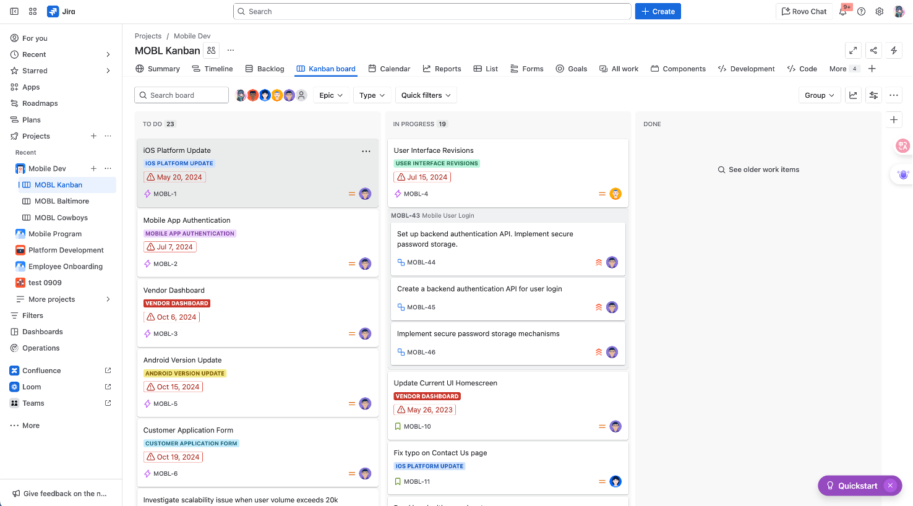
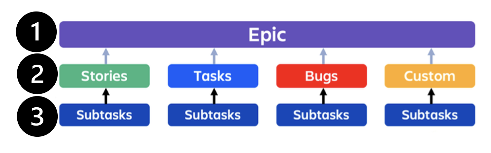
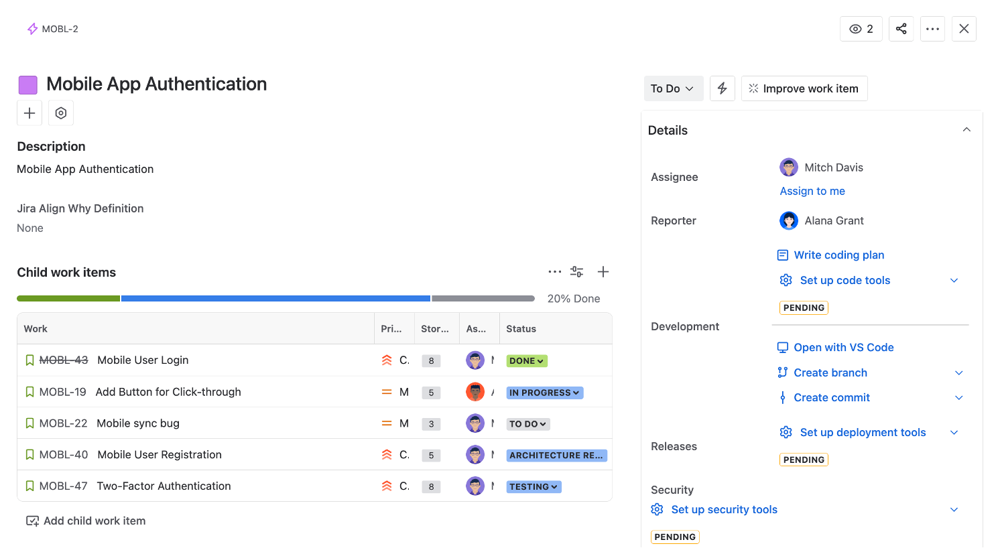

# 什麼是 Jira ？如何開啟 Jira？

35

## 什麼是 Jira？

專案協作工具，可用來分配工作、追踪工作進度。

 

工作單有層級分類，很適合把大型工作顆粒度細化，子任務單們都是為了完成父工作單

 

子任務單完成別忘了回到父工作單查看欄位狀態喔

 

關於創建 Jira ticket 和 Confluence，你是自由的。

不用怕會影響別人的工作

<video width="320" height="240" controls>
<source src="../images/如何從 Jira 創建 Ticket.mp4" type="video/mp4">

您的瀏覽器不支援影片播放。

</video>

<source src="../images/如何從Confluence 開啟Jira.mp4" type="video/mp4">

您的瀏覽器不支援影片播放。

</video>

 