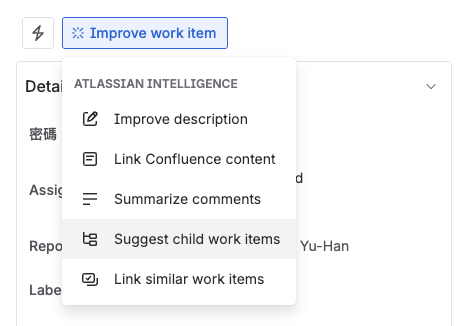
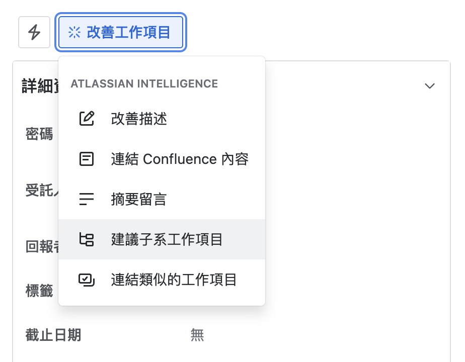

# 關卡二：需求故事之書

## 題目：背景資訊

我們的團隊成員經常需要查找過去的工作記錄、會議決議和專案文件，但目前的搜尋工具效率不佳，導致大量時間浪費在「找資料」這件事上。

根據內部調查：

- 平均每人每天花費 **30 分鐘**尋找過去的資訊
- 有 **40%** 的時間找不到需要的資料
- 重複詢問同事的情況頻繁發生

------

## 模糊需求

**產品經理的原始需求：**

> 「我們需要開發一個功能，讓使用者可以快速找到過去的工作記錄。」
>
> 「使用者常常忘記之前做過什麼，需要一個搜尋功能。」
>
> 「最好可以用自然語言來搜尋，不用記得精確的關鍵字。」
>
> 「搜尋結果要很快，使用者不想等。」

------

## 💡 你的任務

將上述模糊需求轉化為**清晰的 User Story**！

### User Story 格式

As a [角色/使用者類型] 

I want [功能/目標] 

So that [價值/原因]

範例: 

As a 專案經理

I want 快速搜尋過去的專案決策記錄 

So that 我可以在會議中即時參考，避免重複討論

------

## 📝 下一步

1. 分析上述需求，識別出：

   - 使用者角色
   - 核心功能
   - 期望價值

2. 前往 Jira 在 關卡二：需求故事之書 的單子下新增一個 child work item(子系工作項目) 類型：Story(故事)

3. **重要：** Summary(標題名稱) 必須包含關鍵字「**需求描述**」

   - 範例：「需求描述：智慧搜尋歷史記錄功能」

4. 在 Description(描述)欄位 填寫完整的 User Story(使用者故事)  與 Acceptance Criteria (驗收標準)
   (提示：可詢問 AI 產生 Acceptance Criteria！)

5. 完成描述後點擊 Suggest child work item(建議子系工作項目)，自動產生子任務

   

   

6. 將此 Story(故事) 狀態變更為「已完成」

------

🔐 密碼提示
完成任務並將 child work item(子系工作項目) 移動至 **Done(完成)** 後，關卡二：需求故事之書 的密碼欄位將自動出現密碼碎片。