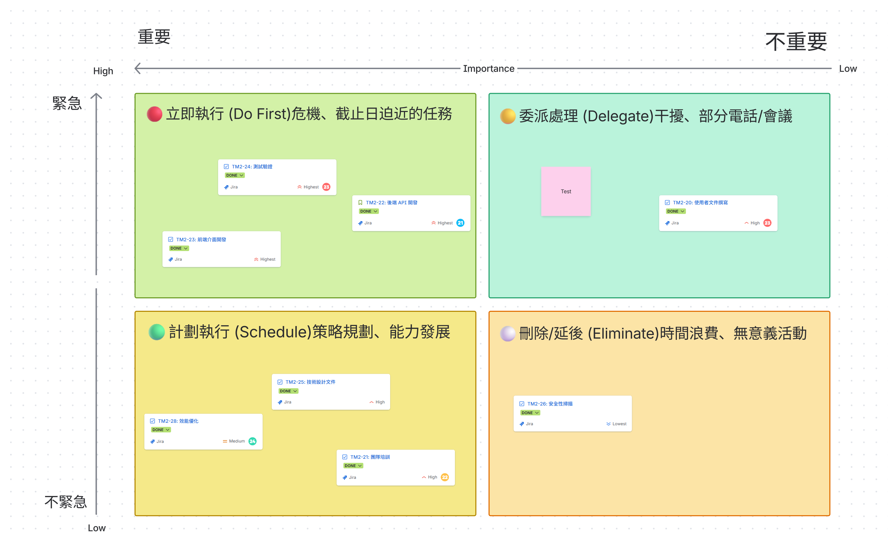

# 關卡五：優先順序矩陣

# 艾森豪優先順序矩陣

------

## 📚 矩陣說明

艾森豪矩陣 (Eisenhower Matrix)

**概念來源：**  
美國前總統艾森豪的時間管理方法，將任務依「緊急」和「重要」兩個維度分類。

**四個象限：**

|            | **重要**                                        | **不重要**                                      |
| :--------- | :---------------------------------------------- | :---------------------------------------------- |
| **緊急**   | 🔴 **立即執行** (Do First)危機、截止日迫近的任務 | 🟡 **委派處理** (Delegate)干擾、部分電話/會議    |
| **不緊急** | 🟢 **計畫執行** (Schedule)策略規劃、能力發展     | ⚪ **刪除/延後** (Eliminate)時間浪費、無意義活動 |

------

### 現有任務清單

1. 技術設計文件
2. 後端 API 開發
3. 前端介面開發
4. 測試驗證
5. 使用者文件撰寫
6. 效能最佳化
7. 安全性掃描
8. 團隊教育訓練

------

## 📊 任務分類矩陣範例

### 🔴 立即執行 (Do First) **緊急且重要 - Priority: Highest**

- [ ] 後端 API 開發（阻礙其他開發）

**理由說明：**

- 後端 API 是前端與測試的前置依賴
- 沒有 API，其他任務無法進行

**Jira Priority 設定：** Highest

------

### 🟢 計畫執行 (Schedule)

**重要但不緊急 - Priority: High**

- [ ] 技術設計文件（重要但可規劃時程）
- [ ] 使用者文件撰寫

**理由說明：**

- 這些任務對長期成功很重要
- 但可以規劃適當時程執行
- 不會立即阻礙專案進度

**Jira Priority 設定：** High

------

### 🟡 委派處理 (Delegate)

**緊急但不重要 - Priority: Medium**

- [ ] 團隊教育訓練（可委派給資深成員帶領）

**理由說明：**

- 需要盡快處理
- 但可以委派給適合的人處理
- 不需要核心團隊親自執行

**Jira Priority 設定：** Medium

------

### ⚪ 刪除/延後 (Eliminate)

**不緊急也不重要 - Priority: Low**

- [ ] 

**理由說明：**

- 可以延後到下個版本
- 或者根本不需要做

**Jira Priority 設定：** Low

------

## 🤖 Rovo AI 分析建議

{tip:💡 使用 Rovo AI 輔助決策}

在 Ask Rovo 中詢問：

**提示詞範例：**

根據智慧搜尋功能專案，分析以下任務的優先順序：

1. 技術設計文件
2. 後端 API 開發
3. 前端介面開發
4. 測試驗證
5. 使用者文件撰寫
6. 效能最佳化
7. 安全性掃描

考量因素：

- 使用者價值
- 技術依賴關係
- 資源可用性
- 風險評估

請給出排序建議和理由。

------

## 📝 下一步

1. 理解艾森豪矩陣的四個象限
2. 此 Confluence 頁面下有各組分頁，找到自己的組別線上白板 Team0 專案任務分類討論
3. 開始討論與分類任務到對應象限 （Tips: Ask Rovo）
4. 分類完成後請把每個任務 Create Jira ticket (建立 Jira 工作項目) 
   1. 注意：
      1. 需要將此 child work item(子系工作項目) 設定在 Parent (父系) 關卡五：優先順序矩陣 之下
      2. 需設定對應象限的 **Priority(優先順序)**
   2. 如何在 Confluence create ticket (建立 Jira 工作項目) 
5. 將 child work item(子系工作項目) 移動至 **Done(完成)** 欄後，即可獲得本關密碼碎片 🔐。

------

🔐 密碼提示
完成任務並將 child work item(子系工作項目) 移動至 **Done(完成)** 後， 關卡五：優先順序矩陣 單子的密碼欄位將自動出現密碼碎片。

